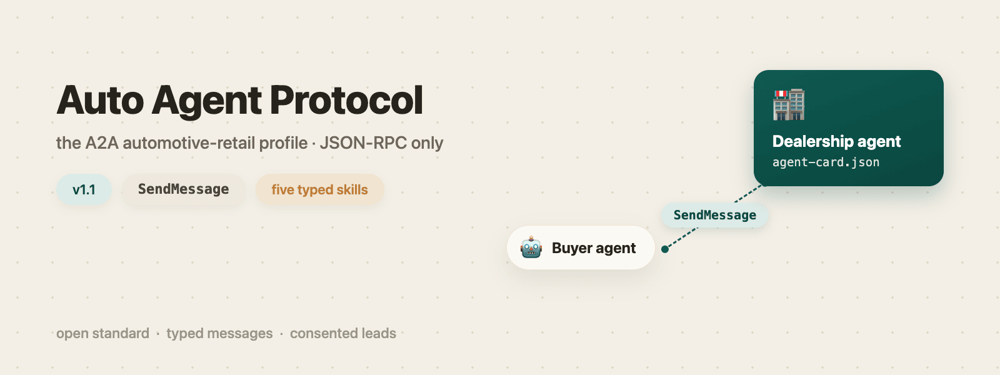
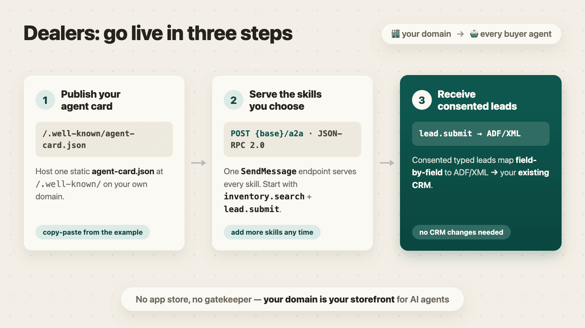
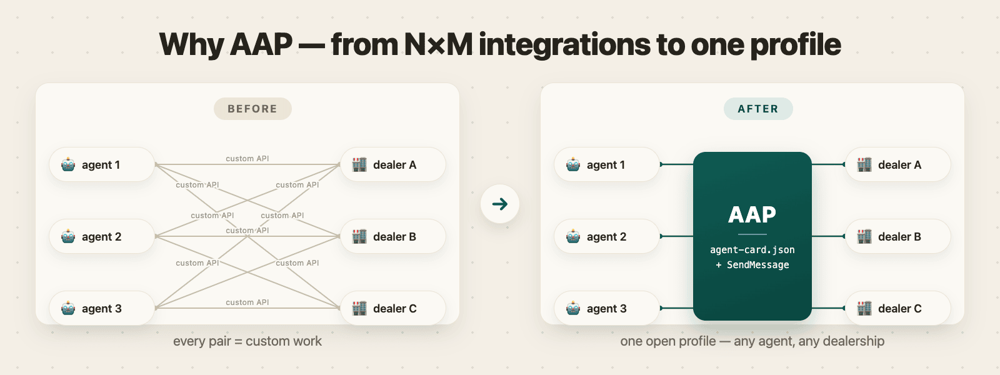
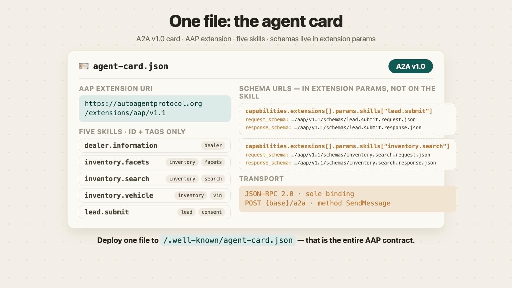
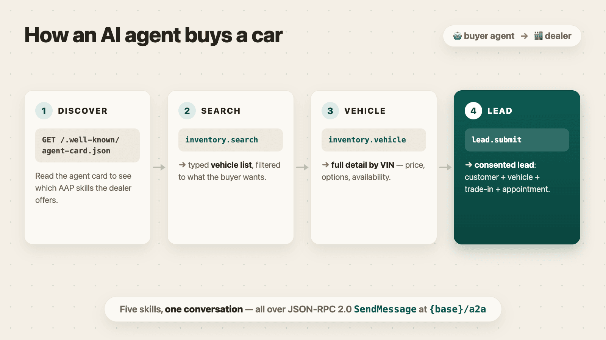
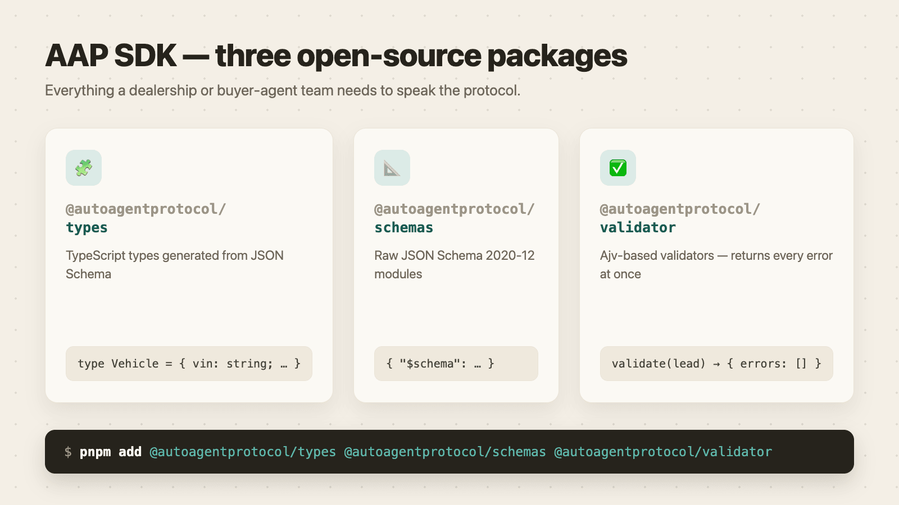

<picture>
  <source media="(prefers-color-scheme: dark)" srcset="static/img/logo-white.png">
  
</picture>

# Auto Agent Protocol (AAP)

[](https://autoagentprotocol.org/docs/latest/intro)
[](https://a2a-protocol.org)
[](LICENSE)
[](https://github.com/auto-agent-protocol/auto-agent-protocol/actions/workflows/validate.yml)



**AAP lets AI assistants shop at your dealership.**

More and more car buyers start their search by asking an AI assistant. AAP is the free, open standard that lets any AI assistant **find your dealership, browse your real inventory, and send you a sales lead with the customer's permission** — straight into the systems you already use. You publish one small file on your own website, answer a few well-defined kinds of questions, and any AAP-capable agent can do business with you. No app store. No middleman. No per-partner integration projects.





**For engineers:** AAP is an open [A2A v1.0](https://a2a-protocol.org) profile. A compliant dealer agent is an A2A agent that publishes an `agent-card.json` with the AAP automotive extension URI (`https://autoagentprotocol.org/extensions/aap/v1.1`) and implements **one or more** of the five standard AAP automotive skills (a small used-car lot might only do `inventory.search` + `lead.submit`; a franchise dealership might do all five).

The transport surface is deliberately minimal: every AAP agent exposes the **JSON-RPC 2.0 binding** — the sole transport (the optional HTTP+JSON binding was removed in v1.1); the only A2A operation AAP uses is **`SendMessage`** — request `Message` in, response `Message` out. The optional A2A surface (streaming, tasks, push notifications, extended cards) is out of scope: dealer agents do not need to implement it and buyer agents must not require it.



## v1.1 Scope

v1.1 is the **current release**. It keeps the v1.0 payload shape — a single `agent-card.json` is the only file a dealer publishes, prices are plain integers, the vehicle and dealer shapes are flat, and `status` is a controlled enum — riding the released A2A v1.0 wire (`SendMessage`, `ROLE_USER`/`ROLE_AGENT`, `supportedInterfaces[]`), and drops the optional HTTP+JSON binding so JSON-RPC 2.0 is the single transport. v0.1, v0.2, and v1.0 remain published and frozen for anyone pinned to them.

- **Discovery** via `/.well-known/agent-card.json` only (A2A-compatible) — no second well-known file
- **Inventory**: facets, search, vehicle detail
- **Dealership information**: group name, welcome message, and one or more rooftops (locations) with address, geo, contacts, hours, timezone, and capabilities
- **Leads**: a single unified `lead.submit` accepting a consented customer plus any combination of vehicle of interest, trade-in, and appointment
- **ADF/XML mapping** documented for legacy CRM compatibility
- **Interoperability proven** against the official A2A v1.0 client SDKs (`@a2a-js/sdk` and `a2a-sdk` for Python) — a standard A2A client can discover an AAP dealer and invoke every skill with no AAP-specific code

v1.1 does **not** cover: authentication (agents are public by default; auth is left to A2A's native `securitySchemes`), payments, financing approval, RFQ/quote flows, trade-in valuations, or reservations.



## Quick links

- **Specification**: [autoagentprotocol.org](https://autoagentprotocol.org)
- **Example agent card** (the single file a dealer deploys): [`spec/v1.1/examples/agent-card.example.json`](spec/v1.1/examples/agent-card.example.json)
- **JSON Schemas**: [`spec/v1.1/schemas/`](spec/v1.1/schemas/)
- **Examples**: [`spec/v1.1/examples/`](spec/v1.1/examples/)
- **OpenAPI 3.1** (built at deploy time): `https://autoagentprotocol.org/v1.1/openapi-jsonrpc.yaml`
- **Changelog**: [CHANGELOG.md](CHANGELOG.md)

## The five skills

| Skill | Purpose |
|---|---|
| `dealer.information` | Dealership profile, address, hours, capabilities |
| `inventory.facets` | Aggregated counts and ranges over the dealer's inventory |
| `inventory.search` | Filtered, paginated inventory queries |
| `inventory.vehicle` | Detail view of one specific vehicle (by VIN, stock, or vehicle_id) |
| `lead.submit` | Unified consented lead — customer + optional(vehicle of interest, trade-in, appointment) |

## Packages



| Package | Description |
|---------|-------------|
| `@autoagentprotocol/types` | TypeScript types generated from JSON Schema |
| `@autoagentprotocol/schemas` | Raw JSON Schema files as importable modules |
| `@autoagentprotocol/validator` | Ajv-based validators for all AAP objects |

## Development

### Prerequisites

- Node.js 22+
- pnpm 10+

### Setup

```bash
pnpm install
```

### Commands

```bash
pnpm run validate          # Validate schemas and examples
pnpm run generate          # Generate types, OpenAPI, doc tables
pnpm run build             # Build the documentation site
pnpm start                 # Start local dev server
```

### Repository structure

```
spec/v1.1/schemas/         JSON Schema 2020-12 source of truth — current version (committed)
spec/v1.1/examples/        Example payloads (committed)
spec/v1.1/skills.yaml      Skills manifest (committed)
spec/v0.1/, spec/v0.2/, spec/v1.0/     Frozen released specs, kept for consumers pinned to them (committed, immutable)
docs/                      Hand-written documentation pages for the current version, v1.1 (committed)
versioned_docs/, versioned_sidebars/, versions.json  Frozen v0.1 + v0.2 + v1.0 docs snapshots (committed)
docs/skills/, bindings/    A2A binding + skill reference (committed)
packages/                  npm packages: types, schemas, validator (committed)
tools/                     Generators, validators, and image sources (committed)
src/components/            FieldCard React component (committed)

generated/                 Auto-generated per version: TS types, OpenAPI bundles, MCP manifest (NOT committed)
static/v0.1/, static/v0.2/, static/v1.0/, static/v1.1/, static/latest/  Spec assets mirrored for the docs site (NOT committed)
build/                     Docusaurus production output (NOT committed)
```

The auto-generated paths above are produced by `pnpm run generate && pnpm run copy-static` (which runs as part of `pnpm run build`). They live in [.gitignore](.gitignore) and are recreated fresh on every CI build, matching A2A's own convention of generating artifacts at build time rather than committing them.

## Versioning

Released versions are immutable. The `latest` URL always points to the highest released version. Each version has its own schema URLs at `https://autoagentprotocol.org/v{version}/schemas/`. See the [versioning policy](https://autoagentprotocol.org/docs/latest/versioning) for the full SemVer rules now in force at 1.1.0.

## How AAP relates to other protocols

| Layer | Protocol | Role for AAP |
|---|---|---|
| Transport / data model (BASE) | **[A2A v1.0](https://a2a-protocol.org)** | The base protocol AAP profiles. Every AAP message travels inside `Message.parts[].data` as a typed `DataPart`. AAP does not invent a wire format. |
| Adjacent / complementary | **ACP** (Agentic Commerce), **MCP** (Model Context Protocol) | ACP covers commerce checkout (out of scope for AAP). MCP can expose AAP skills as LLM tools — AAP publishes an official MCP reference manifest (generated from `skills.yaml` at build time and served at `https://autoagentprotocol.org/v1.1/mcp.json`). |
| Legacy / target system | **ADF/XML** | The 25-year-old dealer-CRM lead format. `lead.submit` is field-by-field mappable to ADF/XML so existing CRMs ingest AAP leads without code changes. |

## License

- Specification and schemas: [Apache-2.0](LICENSE) — chosen (and kept at 1.1.0) for its explicit patent grant, which protects every adopting dealership, platform, and SDK vendor; it is also the license of A2A itself.
- Documentation prose: [CC-BY-4.0](https://creativecommons.org/licenses/by/4.0/)

## Security

See [SECURITY.md](SECURITY.md) for how to report a vulnerability in the spec, schemas, or packages.

## Contributing

See the [Contributing guide](https://autoagentprotocol.org/docs/latest/contributing) for details on proposing changes, and [CODE_OF_CONDUCT.md](CODE_OF_CONDUCT.md) for community standards.
