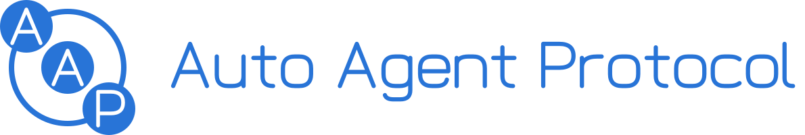
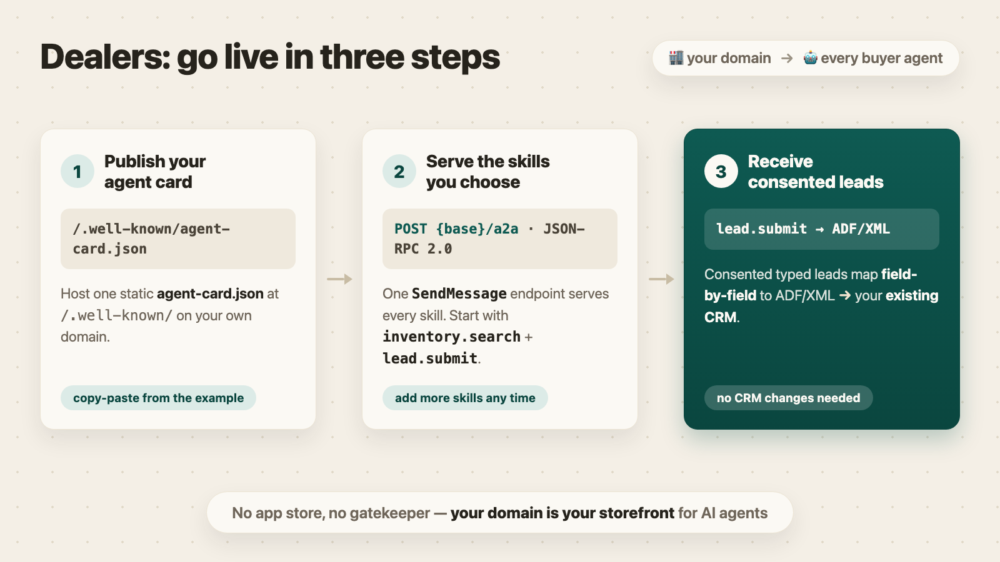
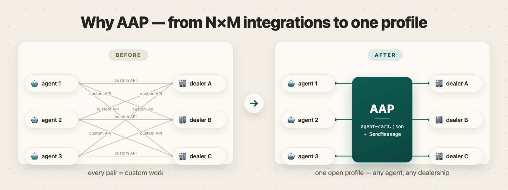
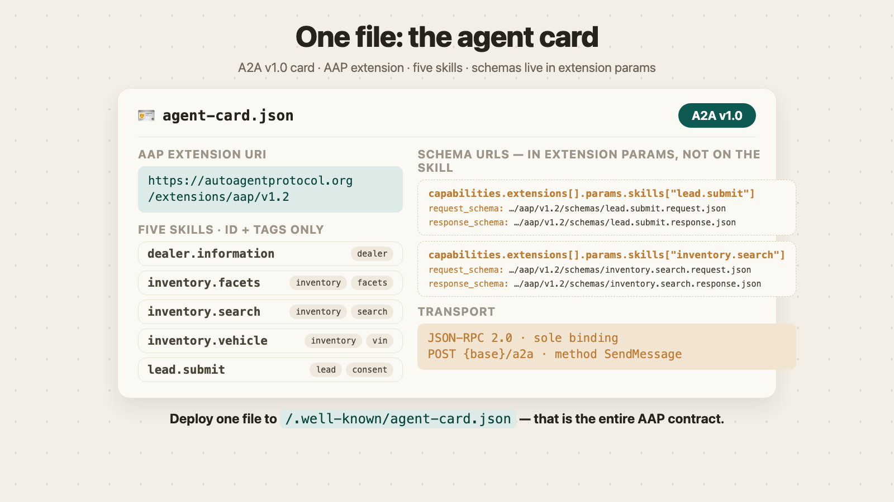
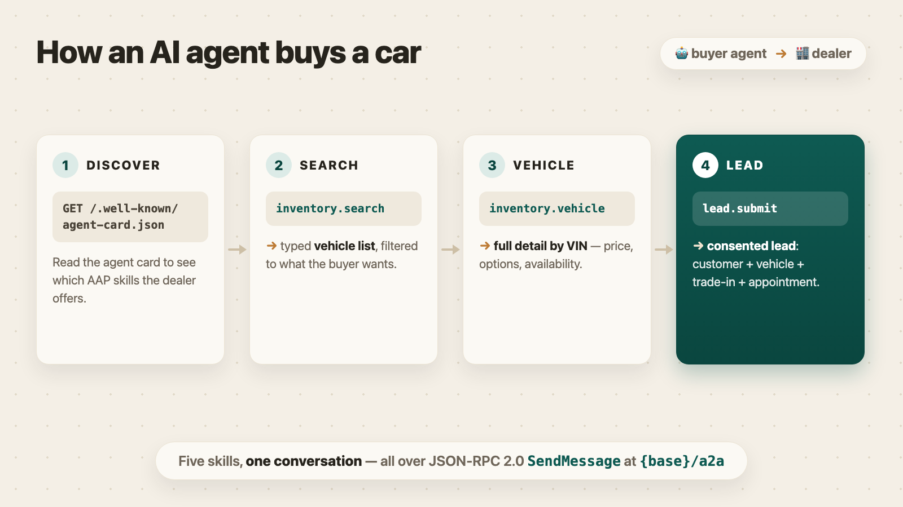
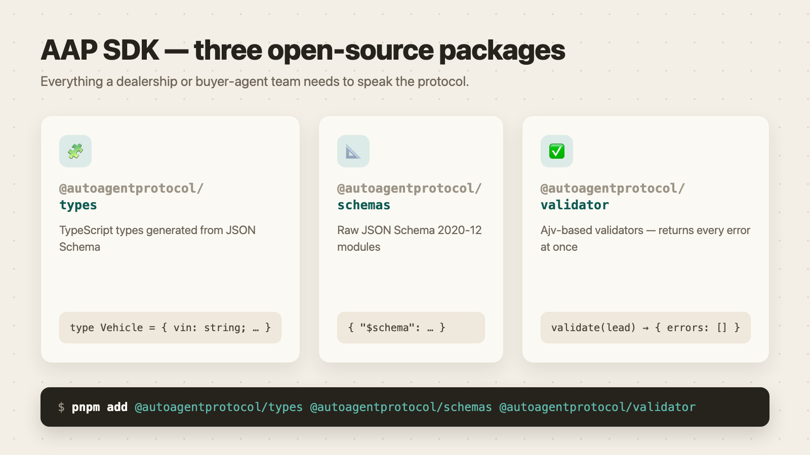

<picture>
  <source media="(prefers-color-scheme: dark)" srcset="static/img/brand/aap-wordmark-white.svg">
  
</picture>

# Auto Agent Protocol (AAP)

[](https://autoagentprotocol.org/docs/latest/intro)
[](https://a2a-protocol.org)
[](LICENSE)
[](https://github.com/auto-agent-protocol/auto-agent-protocol/actions/workflows/validate.yml)

Brand assets: [symbol, wordmark, and usage guidance](tools/branding/README.md).

**AAP lets AI assistants shop at your car or motorcycle dealership.**

More and more car and motorcycle buyers start their search by asking an AI assistant. AAP is the free, open standard that lets any AI assistant **find your dealership, browse your real inventory, and send you a sales lead with the customer's permission** — straight into the systems you already use. You publish one small file on your own website, answer a few well-defined kinds of questions, and any AAP-capable agent can do business with you. No app store. No middleman. No per-partner integration projects.

Listings carry an optional `vehicle_type` (`car`, `motorcycle`, `trailer`, `rv`, `other`; absent = `car`), so the same five skills serve both automotive and powersports retail — including electric models via a generic electric-powertrain field group.





**For engineers:** AAP is an open [A2A v1.0](https://a2a-protocol.org) profile. A compliant dealer agent is an A2A agent that publishes an `agent-card.json` with the AAP automotive extension URI (`https://autoagentprotocol.org/extensions/aap/v1.2`) and implements **one or more** of the five standard AAP automotive skills (a small used-car lot might only do `inventory.search` + `lead.submit`; a franchise dealership might do all five).

The transport surface is deliberately minimal: every AAP agent exposes the **JSON-RPC 2.0 binding** — the sole transport (the optional HTTP+JSON binding was removed in v1.1.0); the only A2A operation AAP uses is **`SendMessage`** — request `Message` in, response `Message` out. The optional A2A surface (streaming, tasks, push notifications, extended cards) is out of scope: dealer agents do not need to implement it and buyer agents must not require it.



## v1.2.0 Scope

v1.2.0 is the **current release**. It is fully additive over v1.1.0: it adds multi-class inventory via the optional `vehicle_type` discriminator (`car`, `motorcycle`, `trailer`, `rv`, `other`; absent = `car`, so existing car integrations keep validating) plus generic electric-powertrain fields (`electric_range_mi`, `battery_kwh`, `motor_power_hp`, `dc_fast_charge`, `charge_port`) that describe any BEV/PHEV unit. It keeps the v1.0.0 AAP payload shape — a single `agent-card.json` is the only file a dealer publishes, prices are plain integers, the vehicle and dealer shapes are flat, and `status` is a controlled enum — riding the released A2A v1.0 wire (`SendMessage`, `ROLE_USER`/`ROLE_AGENT`, `supportedInterfaces[]`), and inherits the JSON-RPC-only transport from v1.1.0 (the optional HTTP+JSON binding was dropped in v1.1.0). v0.1.0, v0.2.0, v1.0.0, and v1.1.0 remain published and frozen for anyone pinned to them.

- **Discovery** via `/.well-known/agent-card.json` only (A2A-compatible) — no second well-known file
- **Inventory**: facets, search, vehicle detail — across **cars and motorcycles** via an optional `vehicle_type` discriminator, with motorcycle body/segment carried in `body`, displacement in `displacement_cc`, niche specs in a free-form `other_attributes` map, and a generic electric-powertrain group (range, battery kWh, motor hp, DC fast charge, charge port) for BEV/PHEV cars and motorcycles alike
- **Dealership information**: group name, welcome message, and one or more rooftops (locations) with address, geo, contacts, hours, timezone, and capabilities (including powersports tags such as `motorcycle_sales`)
- **Leads**: a single unified `lead.submit` accepting a consented customer plus any combination of vehicle of interest, trade-in, and appointment
- **ADF/XML mapping** documented for legacy CRM compatibility
- **Interoperability proven** against the official A2A v1.0 client SDKs (`@a2a-js/sdk` and `a2a-sdk` for Python) — a standard A2A client can discover an AAP dealer and invoke every skill with no AAP-specific code

v1.2.0 does **not** cover: authentication (agents are public by default; auth is left to A2A's native `securitySchemes`), payments, financing approval, RFQ/quote flows, trade-in valuations, or reservations.



## Quick links

- **Specification**: [autoagentprotocol.org](https://autoagentprotocol.org)
- **Stable v1.2.0 agent card**: [`spec/v1.2/examples/agent-card.example.json`](spec/v1.2/examples/agent-card.example.json)
- **Editable JSON Schemas**: [`spec/latest/schemas/`](spec/latest/schemas/)
- **Editable examples**: [`spec/latest/examples/`](spec/latest/examples/)
- **OpenAPI 3.1** (built at deploy time): `https://autoagentprotocol.org/v1.2/openapi-jsonrpc.yaml`
- **Changelog**: [CHANGELOG.md](CHANGELOG.md)

## The five skills

| Skill | Purpose |
|---|---|
| `dealer.information` | Dealership profile, address, hours, capabilities |
| `inventory.facets` | Aggregated counts and ranges over the dealer's inventory |
| `inventory.search` | Filtered, paginated inventory queries (cars and motorcycles) |
| `inventory.vehicle` | Detail view of one specific vehicle or motorcycle (by VIN, stock, or vehicle_id) |
| `lead.submit` | Unified consented lead — customer + optional(vehicle of interest, trade-in, appointment) |

## Packages



| Package | Description |
|---------|-------------|
| `@autoagentprotocol/types` | TypeScript types generated from JSON Schema |
| `@autoagentprotocol/schemas` | Raw JSON Schema files as importable modules |
| `@autoagentprotocol/validator` | Ajv-based validators for all AAP objects |

## Development

### Prerequisites

- Node.js 22+
- pnpm 10+

### Setup

```bash
pnpm install
```

### Commands

```bash
pnpm run validate          # Validate schemas and examples
pnpm run generate          # Generate draft artifacts in generated/latest
pnpm run check:releases    # Verify frozen snapshots and stable packages
pnpm run test:release      # Rehearse release and freeze invariants
pnpm run build             # Build the stable production site
pnpm start                 # Serve editable docs with an unreleased banner
```

### Repository structure

```
spec/latest/               Editable JSON Schema 2020-12, examples, and skills manifest
spec/v*/                   Frozen released specs (committed, immutable)
docs/                      Editable documentation; served locally as an unreleased draft
versioned_docs/, versioned_sidebars/  Frozen release documentation snapshots
releases.json              Explicit release registry and stable-release pointer
releases/v*/               Frozen generated artifacts, provenance, reports, and integrity manifests
docs/skills/, bindings/    A2A binding + skill reference (committed)
packages/                  npm packages: types, schemas, validator (committed)
tools/                     Generators, validators, and image sources (committed)
src/components/            FieldCard React component (committed)

generated/latest/          Auto-generated draft types, OpenAPI, and MCP manifest (NOT committed)
static/v*/, static/latest/ Site assembly output copied from frozen snapshots (NOT committed where applicable)
build/                     Docusaurus production output (NOT committed)
```

Draft artifacts are produced by `pnpm run generate`; production assets are assembled by `pnpm run copy-static`. Published artifact snapshots are committed under `releases/v*/` so a historical release is never regenerated with newer tooling.

## Versioning

Released versions are immutable. Repository changes use `spec/latest/`; the public `latest` URL always points to the release selected by `releases.json`. There is no `next` channel. Each release has pinned schema URLs at `https://autoagentprotocol.org/v{version}/schemas/`. See the [versioning policy](https://autoagentprotocol.org/docs/latest/versioning) and [maintainer release guide](RELEASING.md).

## How AAP relates to other protocols

| Layer | Protocol | Role for AAP |
|---|---|---|
| Transport / data model (BASE) | **[A2A v1.0](https://a2a-protocol.org)** | The base protocol AAP profiles. Every AAP message travels inside `Message.parts[].data` as a typed `DataPart`. AAP does not invent a wire format. |
| Adjacent / complementary | **ACP** (Agentic Commerce), **MCP** (Model Context Protocol) | ACP covers commerce checkout (out of scope for AAP). MCP can expose AAP skills as LLM tools — AAP publishes an official MCP reference manifest (generated from `skills.yaml` at build time and served at `https://autoagentprotocol.org/v1.2/mcp.json`). |
| Legacy / target system | **ADF/XML** | The 25-year-old dealer-CRM lead format. `lead.submit` is field-by-field mappable to ADF/XML so existing CRMs ingest AAP leads without code changes. |

## License

- Specification and schemas: [Apache-2.0](LICENSE) — chosen (and kept at 1.2.0) for its explicit patent grant, which protects every adopting dealership, platform, and SDK vendor; it is also the license of A2A itself.
- Documentation prose: [CC-BY-4.0](https://creativecommons.org/licenses/by/4.0/)

## Security

See [SECURITY.md](SECURITY.md) for how to report a vulnerability in the spec, schemas, or packages.

## Contributing

See the [Contributing guide](https://autoagentprotocol.org/docs/latest/contributing) for details on proposing changes, and [CODE_OF_CONDUCT.md](CODE_OF_CONDUCT.md) for community standards.
