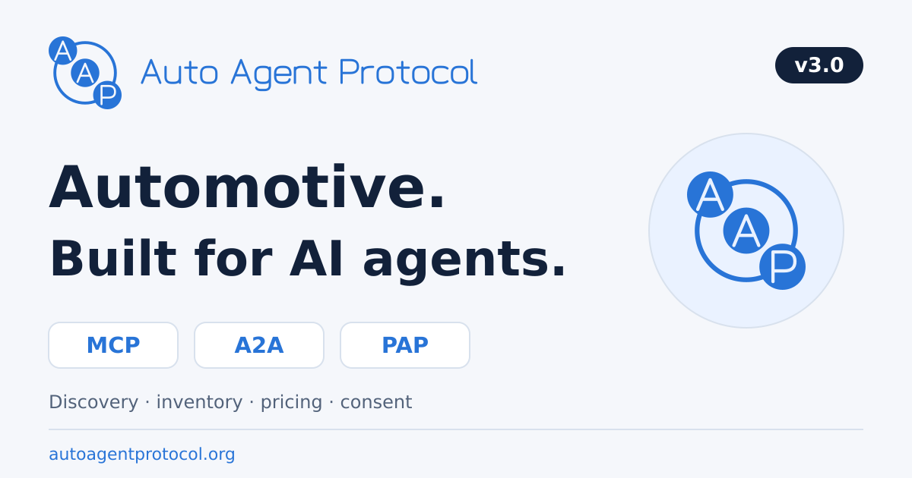
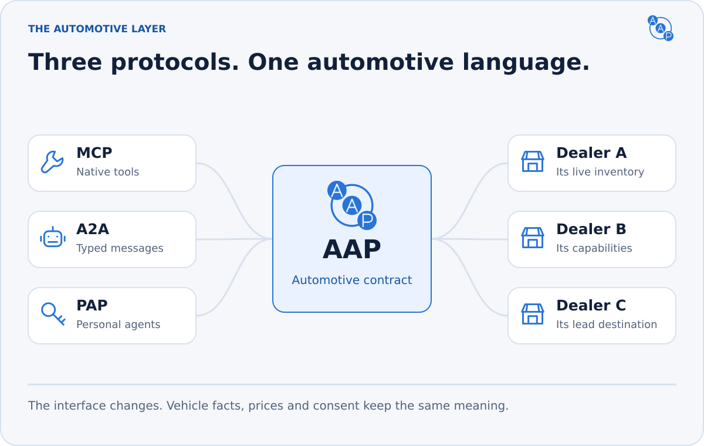
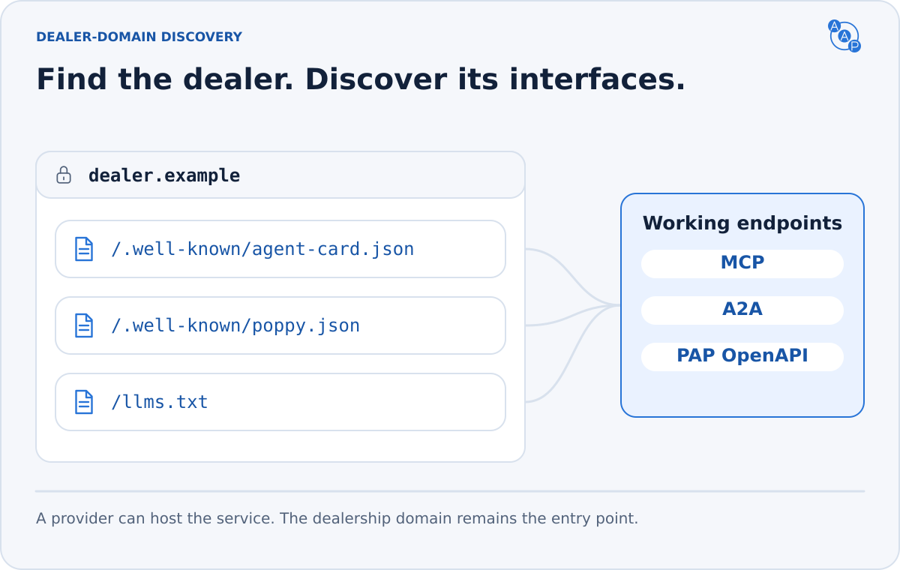
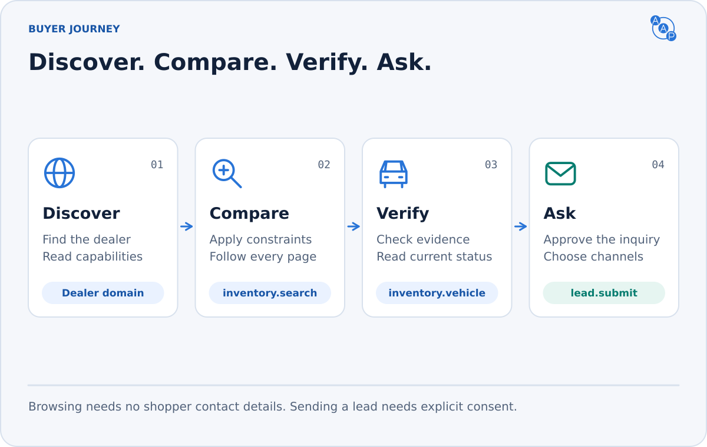
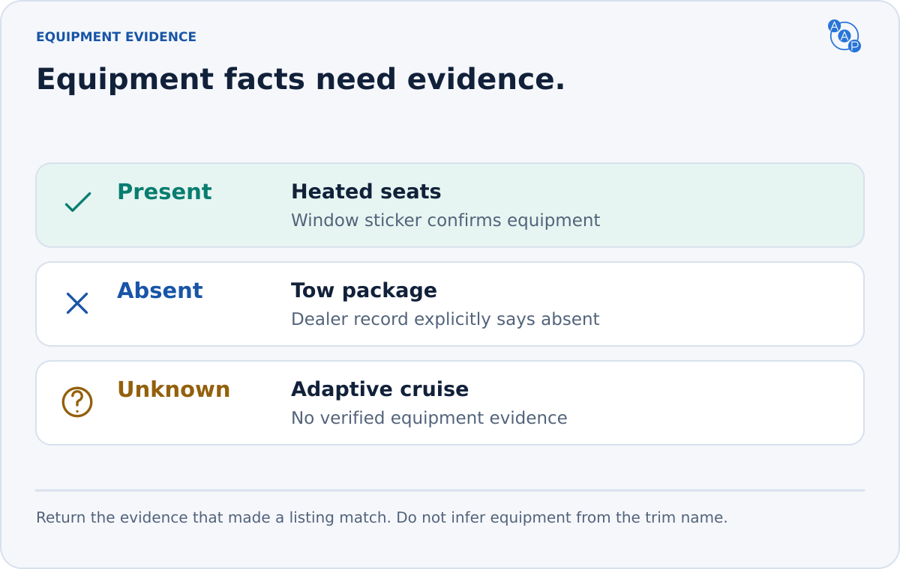

[](https://autoagentprotocol.org)

# Auto Agent Protocol 3.0

[](https://autoagentprotocol.org/docs/v3.0/intro)
[](https://github.com/auto-agent-protocol/auto-agent-protocol/actions/workflows/validate.yml)
[](LICENSE)

**One open automotive contract for MCP, A2A and Personal Agent Protocol.** Discover dealerships, search real inventory, verify vehicle facts and send customer-approved inquiries.

[Website](https://autoagentprotocol.org) · [Specification](https://autoagentprotocol.org/docs/v3.0/intro) · [FAQ](https://autoagentprotocol.org/faq) · [Migration](docs/versioning.md) · [Full spec for agents](https://autoagentprotocol.org/llms-full.txt)



## Native in all three interfaces

| Interface | Native operation | Automotive contract |
|---|---|---|
| **[MCP](docs/bindings/mcp.md)** | Streamable HTTP tools; current `2026-07-28` and `2025-11-25` compatibility | Typed arguments, complete schemas and structured results |
| **[A2A 1.0](docs/bindings/json-rpc.md)** | `SendMessage` with the required AAP extension | The same payload in `DataPart.data` |
| **[PAP 0.2](docs/personal-agent-protocol.md)** | Verified guest Sessions, DPoP and native OpenAPI | The same request and response bodies |

A full AAP 3.0 dealer deployment serves its implemented skill subset through all three. A buyer client needs only its chosen binding. AAP does not require a dealer-side language model or a new CRM.

A working MCP endpoint is required. The generated [`mcp.json` catalog](https://autoagentprotocol.org/v3.0/mcp.json) describes tools; it is not a server. See [conformance and runtime acceptance](docs/conformance.md).

## Discovery starts at the dealership



| Dealer-domain resource | What it tells an agent |
|---|---|
| `/.well-known/agent-card.json` | A2A endpoint, selected AAP contract, skills, search capabilities and MCP/PAP links |
| `/.well-known/poppy.json` | PAP identity, issuer, native API and matching AAP discovery links |
| `/llms.txt` | Exact service URLs, access requirements, documentation and inventory links |

The service may run on a provider’s infrastructure. Every entry point identifies the same dealership and actual capabilities. Discovery helps compatible agents find a service; it does not guarantee that every assistant will choose it.

Start from the [Agent Card](spec/v3.0/examples/agent-card.example.json), [Poppy document](spec/v3.0/examples/poppy.example.json) and [dealer llms.txt](spec/v3.0/examples/llms.txt.example.md). These release-pinned templates use fictional dealers: replace their identity, URLs and capabilities before deployment. [Discovery requirements →](docs/discovery.md)

## Five skills, one automotive journey



[Dealer information](docs/skills/dealer-information.md) · [Facets](docs/skills/inventory-facets.md) · [Search](docs/skills/inventory-search.md) · [Vehicle detail](docs/skills/inventory-vehicle.md) · [Lead submission](docs/skills/lead-submit.md)

Browse without shopper contact details. Submit a lead only with explicit consent, permitted channels and an idempotency key. A received inquiry and a confirmed appointment are separate outcomes.

## What is new in 3.0

- **Native MCP:** real tool discovery and calls, self-contained schemas, structured successes and failures, current and legacy clients.
- **Unified discovery:** exact MCP URL, A2A card, PAP API and `llms.txt` on the dealer domain.
- **Evidence-based search:** supported feature codes, verified equipment, rooftop radius and distance, explicit applied filters and complete cursor pagination.
- **Clear outcomes:** current availability, source timestamps, authoritative prices, channel-specific consent and unambiguous appointment states.



This is a **major-version migration**. AAP 2.x contracts remain immutable. [Migration guide →](docs/versioning.md#for-implementers)

## Automotive detail, shared across vehicle types


Known prices include mandatory dealer charges; only government-required consumer charges are excluded. Optional fee itemization explains the existing total. Unknown equipment and prices stay unknown.

[Vehicle shape](docs/skills/inventory-vehicle.md) · [Pricing](docs/pricing-and-ftc.md) · [Consent and behavior](docs/behavior-rules.md) · [CRM / ADF mapping](docs/compatibility/adf-mapping.md)

Payments, financing approval, reservations and trade-in valuations are outside AAP’s scope.

## Use the packages


```bash
npm install @autoagentprotocol/schemas@3.0.0 @autoagentprotocol/types@3.0.0 @autoagentprotocol/validator@3.0.0
```

| Artifact | Reference |
|---|---|
| JSON Schema 2020-12 | [`spec/v3.0/schemas/`](spec/v3.0/schemas/) |
| Typed and wire examples | [`spec/v3.0/examples/`](spec/v3.0/examples/) |
| MCP tool catalog | [`/v3.0/mcp.json`](https://autoagentprotocol.org/v3.0/mcp.json) |
| A2A JSON-RPC OpenAPI | [`/v3.0/openapi-jsonrpc.yaml`](https://autoagentprotocol.org/v3.0/openapi-jsonrpc.yaml) |
| PAP OpenAPI | [`/v3.0/openapi-poppy.yaml`](https://autoagentprotocol.org/v3.0/openapi-poppy.yaml) |
| Immutable release registry | [`releases.json`](releases.json) |

## Build and verify

Use Node.js 22+ and pnpm 10. Run heavy checks one at a time.

```bash
pnpm install --frozen-lockfile
pnpm validate
pnpm test:contract
pnpm typecheck
pnpm build
```

Official MCP and A2A clients exercise real HTTP contract fixtures. PAP checks cover discovery, identity, session schemas and generated OpenAPI. These validate the specification; each production deployment must also verify live authentication, inventory, consent and CRM behavior.

See [all verification commands](docs/conformance.md#run-the-repository-checks), [release preparation](RELEASING.md) and [visual generation](tools/branding/README.md).

<details>
<summary>Repository map</summary>

| Path | Purpose |
|---|---|
| `spec/latest/`, `docs/` | Editable contract and documentation |
| `docs/img/` | Reproducible SVG diagrams; `pnpm generate:images` |
| `spec/v*/`, `versioned_docs/` | Immutable release snapshots |
| `releases/v*/` | Generated artifacts, provenance and integrity |
| `packages/` | Schemas, types and validator packages |
| `src/` | Website and interactive explanations |
| `tools/` | Generators, validation and release checks |

`/latest` machine artifacts follow the stable registry. `/docs/latest` is editable documentation and may describe a future release. Pin the advertised version for an integration.

</details>

## Contribute

[Contribution guide](docs/contributing.md) · [Security reports](SECURITY.md) · [Code of conduct](CODE_OF_CONDUCT.md) · [Brand assets](tools/branding/README.md)

Specification, schemas and code: [Apache-2.0](LICENSE). Documentation prose: [CC BY 4.0](https://creativecommons.org/licenses/by/4.0/).
