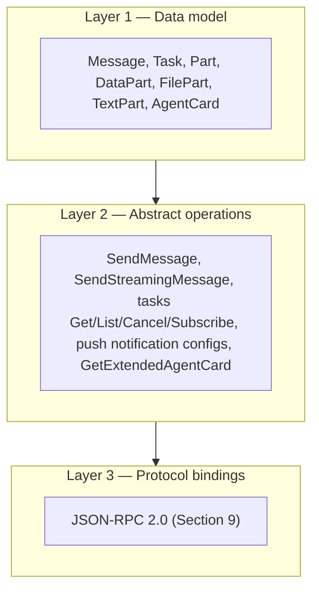

# AAP as an A2A profile


The Auto Agent Protocol is a strict profile of [A2A v1.0](https://a2a-protocol.org). It does not redefine discovery, message envelopes, the task model, or transport. It only constrains the shape of one specific A2A construct: typed `DataParts` carried inside `Message.parts[]`.

AAP v1.1 is compliant with the A2A **v1.0.x** line, **including A2A v1.0.1** — a non-breaking patch that changed no AgentCard, AgentSkill, or message field. Per A2A §3.6 the agent card advertises the `Major.Minor` version only, so AAP cards keep `protocolVersion: "1.0"` (patch numbers are never put on the wire). A2A v1.0.1's one transport nudge — preferring `application/a2a+json` on the HTTP+JSON binding — does not apply to AAP, which uses JSON-RPC 2.0 exclusively. AAP publishes each skill's request/response JSON Schema URLs in `capabilities.extensions[].params` (a free-form A2A `Struct`) rather than on the `AgentSkill` object, because A2A's `AgentSkill` has no schema field in v1.0 or v1.0.1 and strict A2A card parsers reject unknown skill fields.

## The three layers of A2A

A2A is structured in three layers. AAP sits as a profile that constrains layer 1 (data model).



A2A defines several bindings; AAP rides on exactly one — JSON-RPC 2.0 — with the same data model on every call.

## Where AAP fits

AAP is a layer 1 profile. It defines:

1. **Standard skill vocabulary.** Five canonical `skills[].id` values an AAP-compliant agent card draws from: `dealer.information`, `inventory.facets`, `inventory.search`, `inventory.vehicle`, `lead.submit`. An agent declares the subset it actually implements (one or more); none is individually mandatory. AAP RECOMMENDS at least `inventory.search` + `lead.submit` for an end-to-end shopping flow.
2. **Typed `DataPart` payloads.** For each skill, an exact request and response JSON Schema. Each payload includes a `type` field whose value is `<scope>.<thing>.request` or `<scope>.<thing>.response` (e.g. `inventory.search.request`). The AAP version is announced once via the agent-card extension URI; it is not repeated on the wire.
3. **An extension URI.** `https://autoagentprotocol.org/extensions/aap/v1.1`, declared in `capabilities.extensions[]` of the agent card.

AAP does NOT redefine layer 2 (abstract operations) or layer 3 (protocol bindings) — it deliberately uses a minimal slice of each. AAP uses exactly **one** A2A operation: `SendMessage` (the message-only pattern — request `Message` in, response `Message` out). The optional A2A surface (`SendStreamingMessage`, the tasks Get/List/Cancel/Subscribe operations, push notification configs, `GetExtendedAgentCard`) is out of scope for AAP — dealer agents do not need to implement it, and buyer agents MUST NOT require it. On bindings: JSON-RPC 2.0 is the **sole** binding AAP defines — a JSON-RPC interface is REQUIRED on every AAP agent card. The HTTP+JSON (REST) binding was removed in v1.1, and gRPC is out of scope.

## The typed `DataPart` pattern


A2A messages are composed of one or more `parts`. Each part identifies its kind by the member it carries — a part with a `text` member is a `TextPart`, with a `file` member is a `FilePart`, with a `data` member is a `DataPart`. AAP only uses `DataParts` — it never relies on free-text natural-language parsing for protocol semantics.

A `DataPart` looks like this:

```json
{
  "data": {
    "type": "inventory.search.request",
    "filters": { "make": ["Honda"] },
    "pagination": { "skip": 0, "limit": 20 }
  },
  "mediaType": "application/vnd.autoagent.inventory-search-request+json"
}
```

The `type` field is the AAP-typed identifier (e.g. `inventory.search.request`). Every AAP request and response carries a `type` matching the regex `^[a-z_]+(\.[a-z_]+){1,2}$`. This lets a buyer agent or middleware validate the payload against the right schema without inspecting the surrounding A2A envelope. The `mediaType` field on the part advertises the AAP media type so generic A2A middleware can route or filter parts without parsing the inner `data`.

:::note A2A v1.0 wire format — the single canonical ProtoJSON form
AAP rides on **A2A v1.0**, whose single canonical wire format is the ProtoJSON form: the method is `SendMessage`, `Role` is the enum name `"ROLE_USER"` (buyer agent) / `"ROLE_AGENT"` (dealer response), and a `Part` has no `kind` discriminator (it is typed by the member it carries — AAP uses the `data` member). The `Message` has no `kind` discriminator either. **A compliant AAP agent MUST emit and accept this form** so any A2A v1.0 client and the published A2A SDKs (`a2a-js`, `a2a-python`) can parse its replies. Every `Message` carries a unique `messageId`.
:::

### Concrete example: `inventory.search`

A full A2A `Message` carrying an AAP request:

```json
{
  "messageId": "01HZ9Q2V5L8F1U3ABV6K1ETBDEX",
  "role": "ROLE_USER",
  "parts": [
    {
      "data": {
        "type": "inventory.search.request",
        "filters": {
          "make": ["Honda"],
          "condition": ["used", "cpo"],
          "year_min": 2020,
          "price_max": 30000
        },
        "pagination": { "skip": 0, "limit": 20 },
        "sort": { "field": "price", "order": "asc" },
        "privacy": { "anonymous": true }
      },
      "mediaType": "application/vnd.autoagent.inventory-search-request+json"
    }
  ]
}
```

The dealer agent replies with an A2A `Message` containing the AAP response:

```json
{
  "messageId": "01HZ9Q2W9SH5ZB6DUA0J1K2L3M",
  "role": "ROLE_AGENT",
  "parts": [
    {
      "data": {
        "type": "inventory.search.response",
        "data": {
          "total": 1,
          "skip": 0,
          "limit": 20,
          "vehicles": [
            {
              "dealer_id": "dealer_demo_toyota",
              "vin": "1HGCY2F57RA000001",
              "stock": "T12345",
              "year": 2022,
              "make": "Honda",
              "model": "Civic",
              "trim": "EX",
              "condition": "cpo",
              "status": "available",
              "list_price": 24990,
              "price": 26780,
              "inventory_date": "2026-04-12",
              "updated_at": "2026-04-30T10:15:00Z"
            }
          ]
        }
      },
      "mediaType": "application/vnd.autoagent.inventory-search-response+json"
    }
  ]
}
```

The outer envelope around this `Message` is the JSON-RPC 2.0 binding — AAP's sole transport. See [JSON-RPC binding](./bindings/json-rpc.md) for full envelope examples.

## Why typed `DataParts` instead of natural-language parts

An AI agent could in principle stuff a search query into a `TextPart` and let the dealer's LLM parse it. AAP does not allow that for protocol calls because:

- Buyer agents need deterministic schemas to plan and validate.
- Dealer CRMs need structured data to write to ADF/XML and downstream lead pipes.
- Pricing and consent are regulated; ambiguous natural language increases compliance risk.
- Validation tooling (Ajv, ajv-formats, OpenAPI clients) only works on structured payloads.

Protocol calls use typed JSON `DataParts` ONLY; dealer agents MUST ignore any `TextParts`. AAP defines no protocol semantics for free-text parts — only the typed `DataPart` is normative, and a dealer agent MUST NOT derive any protocol meaning from a `TextPart`.

## Discovery and bindings: the rest of the profile

AAP layers one more piece on top of the base A2A surface:

| Piece | Where it lives | Purpose |
|---|---|---|
| Agent card with AAP extension | `/.well-known/agent-card.json` | A2A discovery; declares the AAP extension URI and lists the subset of AAP skills the agent implements. |
| Binding section | A2A Section 9 | How AAP DataParts ride inside JSON-RPC 2.0 envelopes — the sole AAP binding, REQUIRED on every AAP agent card. |

See:

- [Discovery](./discovery.md) for the agent card.
- [JSON-RPC binding](./bindings/json-rpc.md) for the wire format.
