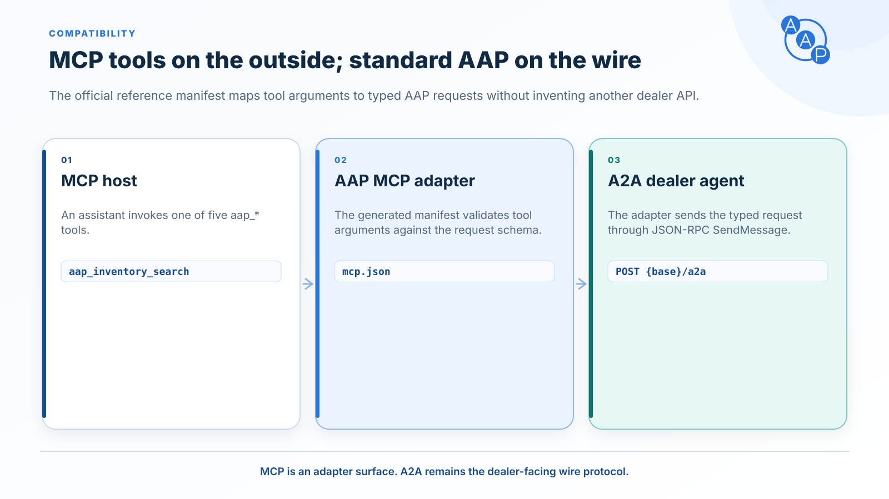

# MCP compatibility

{/* aap-draft-only:start */}

:::info Unreleased contract — planned 2.0.0
This page describes the editable next-major contract, not the frozen v1.3 release. Example extension and schema URLs use the non-routable `draft.autoagentprotocol.invalid` namespace; release preparation replaces them with approved version-pinned URLs. Do not send draft identifiers to a production agent. See [migration guidance](../versioning.md#for-implementers).
:::

{/* aap-draft-only:end */}



[Model Context Protocol](https://modelcontextprotocol.io) (MCP) is a tool layer between an LLM client and a host application. AAP exposes its five skills as MCP tools so any MCP-compatible LLM client (Claude Desktop, an MCP-aware IDE, or a custom orchestrator) can call a dealer agent without learning the A2A wire format directly.

The MCP server acts as a thin adapter: it accepts an MCP `tools/call` request whose `arguments` is exactly an AAP request payload, wraps it as a typed `DataPart` inside an A2A `Message`, and forwards it to the dealer agent's A2A endpoint with a single `SendMessage` call — the only A2A operation AAP uses (request `Message` in, response `Message` out; streaming, tasks, and push notifications are out of scope for this profile). The MCP tool's `inputSchema` is the AAP request schema by URL — no extra wrapping, no field renaming.

## Tool naming

Each AAP skill maps to one MCP tool. The tool name pattern is:

```
aap_<skill_id_with_underscores>
```

Dots become underscores. The five AAP skills map as follows:

| AAP skill id | MCP tool name |
|---|---|
| `dealer.information` | `aap_dealer_information` |
| `inventory.facets` | `aap_inventory_facets` |
| `inventory.search` | `aap_inventory_search` |
| `inventory.vehicle` | `aap_inventory_vehicle` |
| `lead.submit` | `aap_lead_submit` |

## Tool input is the AAP request payload

The MCP tool's `inputSchema` is the AAP request schema (referenced by URL). The MCP server passes `arguments` directly through as the AAP request — no envelope, no extra wrapping. The MCP server is responsible for:

1. Validating `arguments` against the request schema (best practice but optional).
2. Wrapping `arguments` as `Message.parts[].data` (a Part carrying the `data` member).
3. Sending it to the dealer's A2A endpoint as a `SendMessage` call over AAP's single transport, [JSON-RPC 2.0](../bindings/json-rpc.md), which every AAP agent exposes. (The [HTTP+JSON (REST) binding](../bindings/rest.md) was removed in v1.1.0.) The adapter is the A2A client here, so it MUST send the [request headers](../bindings/json-rpc.md#request-headers) — `A2A-Version` and `A2A-Extensions` — on that call; the MCP host never sees them.
4. Unwrapping the dealer's A2A `Message` response and returning the AAP `data` payload as the MCP tool result.

The wrapper must preserve AAP error details and distinguish protocol errors from skill errors. A stock A2A SDK may discard validation or retry details before the wrapper sees them; use the [SDK-specific error handling guidance](../errors.md#sdk-error-handling) when choosing or adapting that transport. Header activation and error recovery are the wrapper's responsibilities, not capabilities automatically supplied by MCP.

The MCP tool result is the AAP response payload (the same thing the dealer returned in `parts[0].data`).

## MCP manifest structure

A complete MCP server descriptor that exposes all five AAP skills as tools, synchronized with [`spec/latest/examples/mcp-manifest.example.json`](https://github.com/auto-agent-protocol/auto-agent-protocol/blob/main/spec/latest/examples/mcp-manifest.example.json):

```json
{
  "name": "auto-agent-protocol",
  "version": "0.0.0-dev",
  "description": "MCP server descriptor that exposes Auto Agent Protocol automotive skills as MCP tools. Each tool's input matches the corresponding AAP request schema; the wrapper invokes the dealer's A2A endpoint with the same payload as a typed DataPart. The wrapper is the A2A client on that call and must send the A2A service-parameter headers: \"A2A-Version: 1.0\" and \"A2A-Extensions: https://draft.autoagentprotocol.invalid/extensions/aap/latest\". An unsupported protocol version is answered with VersionNotSupportedError (-32009); failure to activate the required extension is answered with ExtensionSupportRequiredError (-32008).",
  "protocolVersion": "2025-06-18",
  "tools": [
    {
      "name": "aap_dealer_information",
      "description": "Return the dealership profile — group name, welcome message, and one or more rooftops (locations) with address, geo, contacts, business hours, timezone, default dealer fees, and service capabilities (including tags such as motorcycle_sales / powersports).",
      "inputSchema": {
        "$ref": "https://draft.autoagentprotocol.invalid/latest/schemas/dealer-information-request.schema.json"
      },
      "annotations": {
        "aap_skill_id": "dealer.information",
        "aap_request_type": "dealer.information.request",
        "aap_response_type": "dealer.information.response",
        "aap_response_schema": "https://draft.autoagentprotocol.invalid/latest/schemas/dealer-information-response.schema.json"
      }
    },
    {
      "name": "aap_inventory_facets",
      "description": "Return searchable inventory facets such as makes, models, years, conditions, body styles/segments, price ranges, mileage ranges, drivetrain, fuel type, statuses, vehicle type, engine-displacement range, and electric facets (electric-range span, DC fast charge, charge port).",
      "inputSchema": {
        "$ref": "https://draft.autoagentprotocol.invalid/latest/schemas/inventory-facets-request.schema.json"
      },
      "annotations": {
        "aap_skill_id": "inventory.facets",
        "aap_request_type": "inventory.facets.request",
        "aap_response_type": "inventory.facets.response",
        "aap_response_schema": "https://draft.autoagentprotocol.invalid/latest/schemas/inventory-facets-response.schema.json"
      }
    },
    {
      "name": "aap_inventory_search",
      "description": "Search vehicle inventory by query, make, model, trim, year, condition, price, mileage, body style/segment, VIN, stock, features, and availability — across cars, motorcycles, and other vehicle types, including filters such as vehicle type, body/segment, and engine displacement, plus electric filters such as electric range and DC fast charging.",
      "inputSchema": {
        "$ref": "https://draft.autoagentprotocol.invalid/latest/schemas/inventory-search-request.schema.json"
      },
      "annotations": {
        "aap_skill_id": "inventory.search",
        "aap_request_type": "inventory.search.request",
        "aap_response_type": "inventory.search.response",
        "aap_response_schema": "https://draft.autoagentprotocol.invalid/latest/schemas/inventory-search-response.schema.json"
      }
    },
    {
      "name": "aap_inventory_vehicle",
      "description": "Return details for a specific car or motorcycle by VIN, stock number, or vehicle_id, including status, pricing disclosure, photos, mileage, trim, features, fuel economy or engine displacement, electric range/battery/charging for BEV and PHEV units, and dealer page URL.",
      "inputSchema": {
        "$ref": "https://draft.autoagentprotocol.invalid/latest/schemas/vehicle-detail-request.schema.json"
      },
      "annotations": {
        "aap_skill_id": "inventory.vehicle",
        "aap_request_type": "inventory.vehicle.request",
        "aap_response_type": "inventory.vehicle.response",
        "aap_response_schema": "https://draft.autoagentprotocol.invalid/latest/schemas/vehicle-detail-response.schema.json"
      }
    },
    {
      "name": "aap_lead_submit",
      "description": "Submit a consented lead carrying customer info plus any combination of vehicle of interest, trade-in, and appointment request — a single unified contract that matches how dealerships actually take leads (e.g. test-drive a new car while getting a trade-in appraised in the same visit).",
      "inputSchema": {
        "$ref": "https://draft.autoagentprotocol.invalid/latest/schemas/lead-submit-request.schema.json"
      },
      "annotations": {
        "aap_skill_id": "lead.submit",
        "aap_request_type": "lead.submit.request",
        "aap_response_type": "lead.submit.response",
        "aap_response_schema": "https://draft.autoagentprotocol.invalid/latest/schemas/lead-submit-response.schema.json"
      }
    }
  ]
}
```

During development, a reference manifest is generated from `spec/latest/skills.yaml` into `generated/latest/mcp.json`. A release stores the reviewed manifest under `releases/v{major}.{minor}/artifacts/mcp.json`; production publishes that immutable snapshot rather than regenerating it.

## Calling a tool

An MCP client invokes `tools/call` with the AAP request as `arguments`:

```json
{
  "jsonrpc": "2.0",
  "id": "mcp-1",
  "method": "tools/call",
  "params": {
    "name": "aap_inventory_search",
    "arguments": {
      "type": "inventory.search.request",
      "filters": {
        "make": ["Honda"],
        "condition": ["used", "cpo"],
        "year_min": 2020,
        "price_max": 30000
      },
      "pagination": { "skip": 0, "limit": 20 },
      "sort": { "field": "price", "order": "asc" },
      "privacy": { "anonymous": true }
    }
  }
}
```

The MCP server forwards `arguments` as the AAP `DataPart.data` to the dealer's A2A endpoint and returns the dealer's AAP response payload (the contents of the response `data` block) as the MCP tool result.

## Why this matters

- LLM clients that already speak MCP gain instant access to every AAP-compliant dealer agent through a one-line server registration.
- The MCP `inputSchema` `$ref` points at the AAP schema by URL, so an LLM with schema-following tool use can plan calls against the same source of truth as a hand-written A2A client.
- The MCP server is stateless adapter glue; all business logic — auth, consent enforcement, inventory accuracy — stays in the dealer agent behind A2A.

For more on MCP itself, see the [MCP specification](https://modelcontextprotocol.io). For the single A2A transport the MCP server forwards into, see the [JSON-RPC binding](../bindings/json-rpc.md) (the sole AAP transport, exposed by every AAP agent). The [REST binding](../bindings/rest.md) was removed in v1.1.0.
