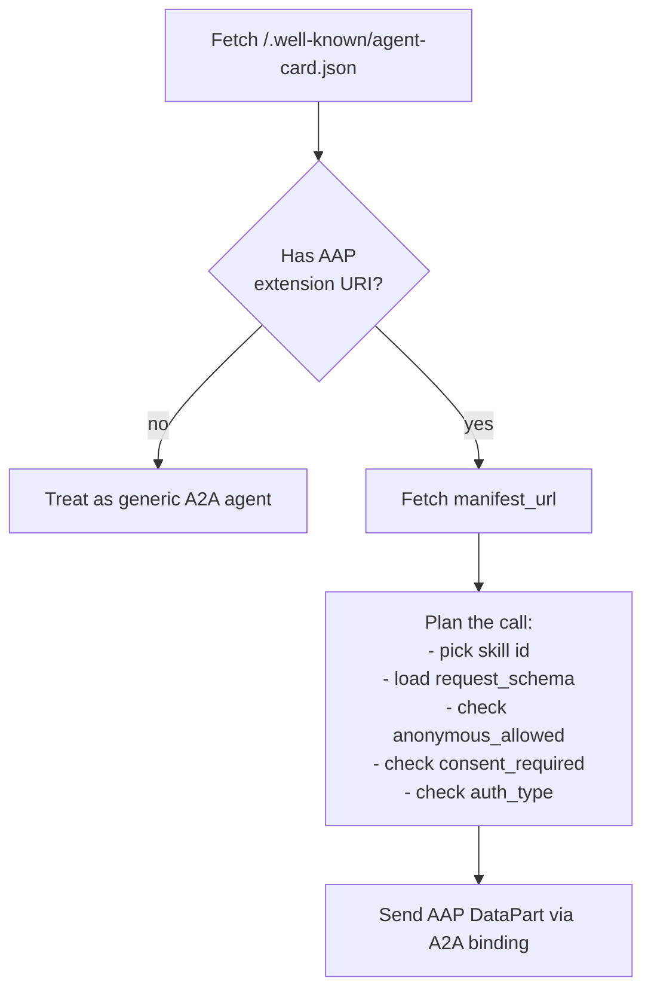

# Contract manifest

Every AAP-compliant dealer agent publishes a second well-known file alongside its A2A agent card:

```
GET https://{dealer-domain}/.well-known/auto-agent-contract.json
```

This file is the **contract manifest**. The agent card points to it via `capabilities.extensions[].params.manifest_url`. The manifest enumerates the seven required skills, their request/response schema URLs, and per-skill `anonymous_allowed` / `consent_required` flags. It also declares the agent's `auth_type` and OPTIONAL LLM guidance.

A buyer agent — especially an LLM-driven one — uses the manifest to plan calls deterministically: which skills can be called anonymously, which require customer consent, and exactly which JSON Schema version to validate a request against.

## Why a separate manifest

The A2A agent card is generic. It tells a buyer agent that an agent exists, what extensions it supports, and how to reach it. It does not say:

- Which exact JSON Schema URL describes each skill's request body for this version.
- Which skills allow anonymous use.
- Which skills require an explicit `ConsentGrant` when customer info is included.
- Whether the lead skills emit ADF-mappable payloads.
- What free-form rules the dealer would like LLM clients to follow.

The contract manifest carries all of that. It is small, deterministic, and cacheable — exactly the shape a planning LLM needs.

## How a buyer agent uses it



For each skill the buyer agent intends to call, it:

1. Looks up the entry in `a2a.skills[]` by `id`.
2. Validates its outgoing AAP request payload against `request_schema` (URL is absolute and version-pinned).
3. Honors the booleans:
   - `anonymous_allowed: false` means the skill will reject calls without a `customer` block (e.g. lead.* skills).
   - `consent_required: true` means whenever a `customer` block is present, a `consent` (`ConsentGrant`) MUST be present too.
4. If the manifest's top-level `auth_type` is `"bearer"`, attaches `Authorization: Bearer <token>` to every call.
5. Optionally reads `llm.rules[]` and `llm.guide_url` for natural-language policy hints.

## Full example

Below is a complete, valid AAP v0.1 contract manifest for a public dealer agent (`auth_type: null`) using the JSON-RPC binding.

```json
{
  "contract": {
    "name": "Auto Agent Protocol A2A Automotive Retail Profile",
    "version": "0.1.0",
    "uri": "https://autoagentprotocol.org/v0.1/"
  },
  "dealer": {
    "dealer_id": "dealer_demo_toyota",
    "name": "Demo Toyota",
    "managed_by": "Lumika AI"
  },
  "a2a": {
    "endpoint": "https://demo-toyota.example.com/a2a/jsonrpc",
    "protocol_binding": "JSONRPC",
    "skills": [
      {
        "id": "dealer.information",
        "request_schema": "https://autoagentprotocol.org/v0.1/schemas/dealer-information-request.schema.json",
        "response_schema": "https://autoagentprotocol.org/v0.1/schemas/dealer-information-response.schema.json",
        "anonymous_allowed": true,
        "consent_required": false
      },
      {
        "id": "inventory.facets",
        "request_schema": "https://autoagentprotocol.org/v0.1/schemas/inventory-facets-request.schema.json",
        "response_schema": "https://autoagentprotocol.org/v0.1/schemas/inventory-facets-response.schema.json",
        "anonymous_allowed": true,
        "consent_required": false
      },
      {
        "id": "inventory.search",
        "request_schema": "https://autoagentprotocol.org/v0.1/schemas/inventory-search-request.schema.json",
        "response_schema": "https://autoagentprotocol.org/v0.1/schemas/inventory-search-response.schema.json",
        "anonymous_allowed": true,
        "consent_required": false
      },
      {
        "id": "inventory.vehicle",
        "request_schema": "https://autoagentprotocol.org/v0.1/schemas/vehicle-detail-request.schema.json",
        "response_schema": "https://autoagentprotocol.org/v0.1/schemas/vehicle-detail-response.schema.json",
        "anonymous_allowed": true,
        "consent_required": false
      },
      {
        "id": "lead.general",
        "request_schema": "https://autoagentprotocol.org/v0.1/schemas/general-lead-request.schema.json",
        "response_schema": "https://autoagentprotocol.org/v0.1/schemas/lead-response.schema.json",
        "anonymous_allowed": false,
        "consent_required": true,
        "adf_compatible": true
      },
      {
        "id": "lead.vehicle",
        "request_schema": "https://autoagentprotocol.org/v0.1/schemas/vehicle-lead-request.schema.json",
        "response_schema": "https://autoagentprotocol.org/v0.1/schemas/lead-response.schema.json",
        "anonymous_allowed": false,
        "consent_required": true,
        "adf_compatible": true
      },
      {
        "id": "lead.appointment",
        "request_schema": "https://autoagentprotocol.org/v0.1/schemas/appointment-lead-request.schema.json",
        "response_schema": "https://autoagentprotocol.org/v0.1/schemas/appointment-lead-response.schema.json",
        "anonymous_allowed": false,
        "consent_required": true,
        "adf_compatible": true
      }
    ]
  },
  "auth_type": null,
  "llm": {
    "guide_url": "https://demo-toyota.example.com/.well-known/auto-agent-llm-guide.md",
    "rules": [
      "Use inventory.search or inventory.vehicle before submitting a lead if the user is still researching.",
      "Do not submit lead.general, lead.vehicle, or lead.appointment unless the user explicitly consents to share contact information with this dealer.",
      "Use lead.vehicle for vehicle-specific CRM/ADF leads.",
      "Use lead.appointment for test drive, call, video call, showroom visit, or trade-in appraisal appointment requests.",
      "Never invent VIN, stock number, price, availability, or consent."
    ]
  }
}
```

## Field reference

### `contract`

| Field | Type | Description |
|---|---|---|
| `name` | string | Human name of the contract. AAP v0.1 uses `Auto Agent Protocol A2A Automotive Retail Profile`. |
| `version` | string | Contract version (e.g. `0.1.0`). |
| `uri` | URI | Stable URI for this contract version (e.g. `https://autoagentprotocol.org/v0.1/`). |

### `dealer`

| Field | Type | Description |
|---|---|---|
| `dealer_id` | string | Stable dealer identifier (the same `dealer_id` returned by `dealer.information`). |
| `name` | string | Dealer trade name. |
| `managed_by` | string | Operator/integrator running this dealer agent (e.g. CRM vendor, AI platform). Optional. |

### `a2a`

| Field | Type | Description |
|---|---|---|
| `endpoint` | URI | Base A2A endpoint URL. The full `message:send` URL is binding-specific. |
| `protocol_binding` | enum | `JSONRPC` or `HTTP+JSON`. |
| `skills[]` | array | One entry per AAP skill (all 7 are required). |

Each `skills[]` entry:

| Field | Type | Description |
|---|---|---|
| `id` | enum | One of the seven AAP skill ids. |
| `request_schema` | URI | Absolute URL to the JSON Schema for the AAP request body. |
| `response_schema` | URI | Absolute URL to the JSON Schema for the AAP response body. |
| `anonymous_allowed` | boolean | Whether the skill MAY be invoked without authentication or consent. |
| `consent_required` | boolean | Whether the skill REQUIRES a `ConsentGrant` when customer info is included. |
| `adf_compatible` | boolean | Only meaningful for `lead.*` skills; indicates the dealer can ingest the lead as ADF/XML. |

### Top-level fields

| Field | Type | Description |
|---|---|---|
| `auth_type` | `null` or `"bearer"` | Authentication mode. `null` = public; `"bearer"` = `Authorization: Bearer <token>` required. MUST agree with the agent card's `security_requirements`. |
| `llm.guide_url` | URI | OPTIONAL link to a free-form LLM guide. |
| `llm.rules[]` | string[] | OPTIONAL natural-language rules the dealer recommends LLM clients follow. |

## Versioning of the manifest

The `contract.uri` and the schema URLs are version-pinned to `v{version}`. Released versions are immutable: a buyer agent that successfully called a manifest at `https://autoagentprotocol.org/v0.1/` can safely cache the schema URLs forever. See [Versioning](./versioning.md).
