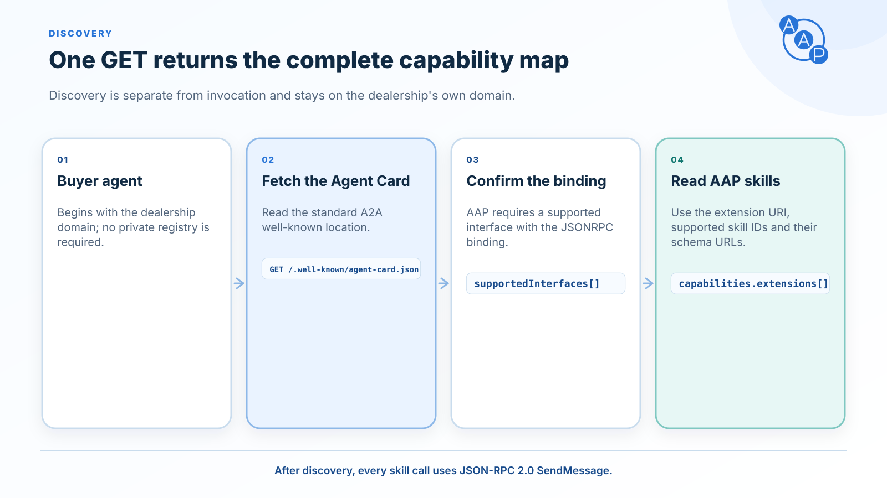

# Discovery

{/* aap-draft-only:start */}

:::info Unreleased contract — planned 2.0.0
This page describes the editable next-major contract, not the frozen v1.3 release. Example extension and schema URLs use the non-routable `draft.autoagentprotocol.invalid` namespace; release preparation replaces them with approved version-pinned URLs. Do not send draft identifiers to a production agent. See [migration guidance](./versioning.md#for-implementers).
:::

{/* aap-draft-only:end */}



An AAP-compliant dealer agent publishes its default A2A v1.0 agent card at the well-known URL on its domain:

```
GET https://{dealer-domain}/.well-known/agent-card.json
```

The card MUST declare the AAP extension and list the AAP skills the agent implements (one or more from the vocabulary of five). The buyer agent uses the card to confirm AAP compliance and discover which skills are actually available before calling any skill. AAP uses a single transport — JSON-RPC 2.0.

## Required AAP additions to the A2A agent card

The AgentCard structure itself is defined by [A2A](https://a2a-protocol.org/latest/specification/) — AAP does not redefine it. AAP only narrows it: an AAP-compliant agent card MUST satisfy all of:

1. `capabilities.extensions[]` contains an entry whose `uri` equals:

   ```
   https://draft.autoagentprotocol.invalid/extensions/aap/latest
   ```

   The entry MUST be marked `required: true`, and a card MUST declare exactly one AAP extension URI. AAP is a **profile extension** in A2A's taxonomy — it narrows the shape of every message rather than adding optional metadata — so a client that has not activated it cannot be served as an AAP client. The consequence is on the wire: a buyer agent MUST activate the extension with the `A2A-Extensions` header on every call — A2A defines the field as "if true, the client must understand and comply with the extension's requirements" (`a2a.proto`, `AgentExtension.required`, normative per A2A §1.4) — and a dealer agent MUST reject a request that does not with `ExtensionSupportRequiredError` (A2A §3.3.4). See [request headers](./bindings/json-rpc.md#request-headers).

   The single-version rule is an AAP profile choice. A2A can activate multiple supported extensions, but two entries marked required would require both; they do not express an either/or choice of AAP versions. A dealer migrating between AAP versions serves each version from its own agent card and interface URL. One origin has one default well-known card; other version-specific cards are discovered through explicitly configured URLs or registries, or through well-known cards on separate origins. The deployment documents which version the default card selects. See [version discovery during migration](./versioning.md#for-implementers). A2A §4.6.3 separately forbids automatic fallback to an earlier extension version.

   AAP v1.3 and earlier do not mandate `required`; the rule above is a major-release change. A v1.3 dealer that leaves the field absent remains conformant with v1.3.

2. `skills[]` contains one entry per AAP skill the agent implements (one or more). Buyer agents discover capability from `skills[]`, not from the AAP extension URI alone. AAP RECOMMENDS that an agent expose at least `inventory.search` + `lead.submit` for a meaningful shopping experience, but no single skill is individually required.

3. `supportedInterfaces[]` includes an entry whose `protocolBinding` is `JSONRPC` (REQUIRED on every AAP agent card). JSON-RPC 2.0 is the sole AAP binding; the HTTP+JSON (REST) binding was [removed in v1.1.0](./bindings/rest.md), and gRPC is out of scope for AAP.

   A2A §8.3.2 treats `supportedInterfaces[]` as preference-ordered, so the JSONRPC entry SHOULD come first for AAP clients. Additional bindings are outside AAP's conformance requirements, but [A2A §5.1](https://a2a-protocol.org/v1.0.0/specification/#51-functional-equivalence-requirements) requires all bindings on the same card to expose equivalent functionality, behavior, errors and authentication. An unrelated service belongs on a separate card. If an interface sets `tenant`, a client **MUST** echo that opaque value in the `tenant` field of every request to it.

A buyer agent that does not find a matching extension URI MUST treat the agent as a generic A2A agent, not as an AAP dealer agent.

## Transport security

Every AAP endpoint — the agent card URL and every `supportedInterfaces[].url` — **MUST** be served over HTTPS in production. This is not an AAP addition: A2A makes it a MUST in §7.1 and again in §13.4, and the canonical `a2a.proto` says `AgentInterface.url` "must be a valid absolute HTTPS URL in production". `http://` is permitted only for a local development harness on loopback, and a card carrying one MUST NOT be published.

This URL rule also applies to additional interfaces. The [normative `AgentInterface` definition](https://github.com/a2aproject/A2A/blob/v1.0.0/specification/a2a.proto#L336) explicitly illustrates a gRPC interface with an HTTPS URL. A gRPC library's bare `hostname:port` channel target is not the URL to publish on the card.

Public does not mean plaintext. `lead.submit` carries a customer's name, email, phone and postal address, so a plaintext AAP endpoint exposes personal data in transit regardless of whether the dealer requires authentication.

## Authentication

AAP agents are **public by default** — the simplest setup needs no authentication. AAP defines no auth of its own. A dealer that wants to protect its endpoint uses A2A's native `securitySchemes` / `securityRequirements` on the agent card (e.g. HTTP bearer), and buyer agents obtain credentials out of band, exactly as A2A specifies. Auth is therefore an A2A/transport concern, out of scope for this profile beyond what A2A already provides.

## Full example agent card

This is the **smallest** card that satisfies the three requirements above — a public dealer agent on the JSON-RPC binding. Copy it, change the `name`, the `supportedInterfaces[].url`, and `params.id`, and keep only the skills you actually implement — pruning both `skills[]` and `params.skills` to match. The matching editable example is in [`spec/latest/examples/agent-card.example.json`](https://github.com/auto-agent-protocol/auto-agent-protocol/blob/main/spec/latest/examples/agent-card.example.json). The frozen v1.3 example remains a different contract.

```json
{
  "name": "Demo Toyota",
  "description": "Auto Agent Protocol dealer agent for Demo Toyota \u2014 browse inventory and submit consented leads over A2A.",
  "supportedInterfaces": [
    {
      "url": "https://demo-toyota.example.com/a2a",
      "protocolBinding": "JSONRPC",
      "protocolVersion": "1.0"
    }
  ],
  "provider": {
    "organization": "Lumika AI",
    "url": "https://lumika.ai"
  },
  "version": "1.0.0",
  "documentationUrl": "https://autoagentprotocol.org/",
  "capabilities": {
    "extensions": [
      {
        "uri": "https://draft.autoagentprotocol.invalid/extensions/aap/latest",
        "description": "Auto Agent Protocol v0.0.0-dev \u2014 A2A Automotive Retail Profile.",
        "required": true,
        "params": {
          "id": "0192f3c0-1a2b-7c3d-8e4f-5a6b7c8d9e0f",
          "version": "0.0.0-dev",
          "schema_base_url": "https://draft.autoagentprotocol.invalid/latest/schemas/",
          "skills": {
            "dealer.information": {
              "request_schema": "https://draft.autoagentprotocol.invalid/latest/schemas/dealer-information-request.schema.json",
              "response_schema": "https://draft.autoagentprotocol.invalid/latest/schemas/dealer-information-response.schema.json"
            },
            "inventory.facets": {
              "request_schema": "https://draft.autoagentprotocol.invalid/latest/schemas/inventory-facets-request.schema.json",
              "response_schema": "https://draft.autoagentprotocol.invalid/latest/schemas/inventory-facets-response.schema.json"
            },
            "inventory.search": {
              "request_schema": "https://draft.autoagentprotocol.invalid/latest/schemas/inventory-search-request.schema.json",
              "response_schema": "https://draft.autoagentprotocol.invalid/latest/schemas/inventory-search-response.schema.json"
            },
            "inventory.vehicle": {
              "request_schema": "https://draft.autoagentprotocol.invalid/latest/schemas/vehicle-detail-request.schema.json",
              "response_schema": "https://draft.autoagentprotocol.invalid/latest/schemas/vehicle-detail-response.schema.json"
            },
            "lead.submit": {
              "request_schema": "https://draft.autoagentprotocol.invalid/latest/schemas/lead-submit-request.schema.json",
              "response_schema": "https://draft.autoagentprotocol.invalid/latest/schemas/lead-submit-response.schema.json"
            }
          }
        }
      }
    ]
  },
  "defaultInputModes": [
    "application/vnd.autoagent.dealer-information-request+json",
    "application/vnd.autoagent.inventory-facets-request+json",
    "application/vnd.autoagent.inventory-search-request+json",
    "application/vnd.autoagent.vehicle-detail-request+json",
    "application/vnd.autoagent.lead-submit-request+json"
  ],
  "defaultOutputModes": [
    "application/vnd.autoagent.dealer-information-response+json",
    "application/vnd.autoagent.inventory-facets-response+json",
    "application/vnd.autoagent.inventory-search-response+json",
    "application/vnd.autoagent.vehicle-detail-response+json",
    "application/vnd.autoagent.lead-submit-response+json"
  ],
  "skills": [
    {
      "id": "dealer.information",
      "name": "Dealer Information",
      "description": "Return the dealership profile — group name, welcome message, and one or more rooftops (locations) with address, geo, contacts, business hours, timezone, default dealer fees, and service capabilities (including tags such as motorcycle_sales / powersports).",
      "tags": [
        "dealer",
        "dealership",
        "profile",
        "hours",
        "contact",
        "locations",
        "fees",
        "automotive",
        "motorcycles",
        "powersports"
      ],
      "inputModes": [
        "application/vnd.autoagent.dealer-information-request+json"
      ],
      "outputModes": [
        "application/vnd.autoagent.dealer-information-response+json"
      ]
    },
    {
      "id": "inventory.facets",
      "name": "Inventory Facets",
      "description": "Return searchable inventory facets such as makes, models, years, conditions, body styles/segments, price ranges, mileage ranges, drivetrain, fuel type, statuses, vehicle type, engine-displacement range, and electric facets (electric-range span, DC fast charge, charge port).",
      "tags": [
        "inventory",
        "facets",
        "aggregation",
        "filters",
        "automotive",
        "motorcycles",
        "powersports"
      ],
      "inputModes": [
        "application/vnd.autoagent.inventory-facets-request+json"
      ],
      "outputModes": [
        "application/vnd.autoagent.inventory-facets-response+json"
      ]
    },
    {
      "id": "inventory.search",
      "name": "Inventory Search",
      "description": "Search vehicle inventory by query, make, model, trim, year, condition, price, mileage, body style/segment, VIN, stock, features, and availability — across cars, motorcycles, and other vehicle types, including filters such as vehicle type, body/segment, and engine displacement, plus electric filters such as electric range and DC fast charging.",
      "tags": [
        "inventory",
        "vehicles",
        "search",
        "cars",
        "motorcycles",
        "powersports",
        "automotive"
      ],
      "inputModes": [
        "application/vnd.autoagent.inventory-search-request+json"
      ],
      "outputModes": [
        "application/vnd.autoagent.inventory-search-response+json"
      ]
    },
    {
      "id": "inventory.vehicle",
      "name": "Vehicle Detail",
      "description": "Return details for a specific car or motorcycle by VIN, stock number, or vehicle_id, including status, pricing disclosure, photos, mileage, trim, features, fuel economy or engine displacement, electric range/battery/charging for BEV and PHEV units, and dealer page URL.",
      "tags": [
        "inventory",
        "vehicle",
        "vin",
        "stock",
        "detail",
        "automotive",
        "motorcycles",
        "powersports"
      ],
      "inputModes": [
        "application/vnd.autoagent.vehicle-detail-request+json"
      ],
      "outputModes": [
        "application/vnd.autoagent.vehicle-detail-response+json"
      ]
    },
    {
      "id": "lead.submit",
      "name": "Submit Lead",
      "description": "Submit a consented lead carrying customer info plus any combination of vehicle of interest, trade-in, and appointment request — a single unified contract that matches how dealerships actually take leads (e.g. test-drive a new car while getting a trade-in appraised in the same visit).",
      "tags": [
        "lead",
        "contact",
        "consent",
        "sales",
        "appointment",
        "automotive",
        "motorcycles",
        "powersports"
      ],
      "inputModes": [
        "application/vnd.autoagent.lead-submit-request+json"
      ],
      "outputModes": [
        "application/vnd.autoagent.lead-submit-response+json"
      ]
    }
  ]
}
```

`provider` names who operates the agent. The AAP extension's `params.id` is a unique identifier (UUID v7 recommended) the dealer regenerates whenever the card changes — onboarding tools cache it to cheaply detect changes. The published per-skill request/response JSON Schemas also live inside the extension `params` — under `capabilities.extensions[].params.skills["<id>"].request_schema` / `response_schema` — not as fields on the A2A `skills[]` entries — `capabilities.extensions[].params` is where A2A puts extension-specific configuration. Both `params` and any AAP-specific data live inside the extension entry, which is the only A2A-sanctioned place for it.

Each skill carries the A2A-required `tags` (keywords clients/LLMs use to categorize and rank skills). `defaultInputModes` and `defaultOutputModes` are REQUIRED by A2A and MUST name the media types the agent actually exchanges — for AAP that is the `application/vnd.autoagent.*` family, never a bare `application/json`, because a buyer agent intersects its `configuration.acceptedOutputModes` against them. A dealer SHOULD also pin per-skill `inputModes` / `outputModes` to that skill's pair. `documentationUrl`, `signatures`, and `securitySchemes` + `securityRequirements` for auth remain optional A2A surface a dealer MAY add. Note that the optional A2A surface beyond `SendMessage` (streaming, tasks, push notification configs, extended agent card) is out of scope for AAP — dealer agents do not need to implement it and buyer agents MUST NOT require it. The AgentCard shape is A2A's; see the [A2A spec](https://a2a-protocol.org/latest/specification/).

## What a buyer agent does next

Once the card is fetched and validated:

1. Read `skills[]` from the card to learn which AAP skills the agent implements. The request/response JSON Schema for each skill is defined by the AAP spec itself (this docs site), version-pinned by the extension URI, and the card publishes the schemas inline under `capabilities.extensions[].params.skills["<id>"].request_schema` / `response_schema`.
2. Send the required [request headers](./bindings/json-rpc.md#request-headers) on every call: `A2A-Version: 1.0` (A2A requires it on every request) and `A2A-Extensions: https://draft.autoagentprotocol.invalid/extensions/aap/latest` (activates the AAP profile the card declares `required`).
3. Invoke skills via standard A2A `SendMessage` over the [JSON-RPC binding](./bindings/json-rpc.md) — JSON-RPC 2.0 is the only AAP transport (the [REST binding was removed in v1.1.0](./bindings/rest.md)). `SendMessage` is the only A2A operation AAP uses: request `Message` in, response `Message` out. If the card declares A2A `securitySchemes`, obtain credentials out of band first.
