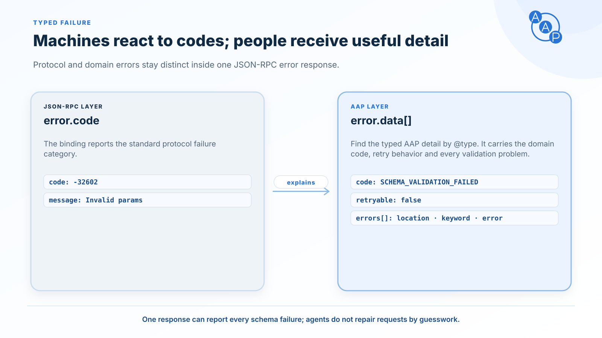

# Errors

{/* aap-draft-only:start */}

This editable page describes the planned **2.0.0** contract, not the frozen v1.3.0 contract. Existing v1.3 endpoints retain their released error shape and activation behavior; see [migration guidance](./versioning.md#for-implementers). Draft extension identifiers below are illustrative and MUST NOT be deployed; release preparation replaces them with the approved version URI.

{/* aap-draft-only:end */}



AAP defines a single typed error payload (`aap.error`) that every dealer agent MUST use when a skill cannot be fulfilled. It rides as one entry of the `error.data` **array** that A2A §9.5 and §3.3.2 require, tagged with `@type` ([Section 9.5](./bindings/json-rpc.md#error-mapping-a2a-section-95)).

The array MUST lead with a `google.rpc.ErrorInfo` carrying `reason` = the AAP code, `domain` = `autoagentprotocol.org`, and string-valued `metadata` for `code`, `error_id`, `retryable` and `created_at`. Duplicate the AAP code into `metadata.code`: an SDK may expose only the metadata and discard `reason`. `ErrorInfo.metadata` is a `map<string,string>`, so every value is a JSON string (`"false"`, not `false`).

Dealer agents MAY append further well-known A2A detail objects as additional entries. Buyer agents MUST locate the AAP payload by its `@type`, never by array position, and MUST ignore entries whose `@type` they do not recognize. AAP defines a single transport — JSON-RPC 2.0; the HTTP+JSON (REST) binding was [removed in v1.1.0](./bindings/rest.md).

## SDK error handling

The array envelope fixes the wire contract; it does not guarantee that a stock SDK exposes its contents or retries automatically. The following findings are pinned to the reviewed JSON-RPC implementations, not promises about all SDK versions:

| Reference implementation | Recognized codes, including `-32008` | Unrecognized `-32000`, including AAP `RATE_LIMITED` |
|---|---|---|
| [a2a-python `b264a6f`](https://github.com/a2aproject/a2a-python/blob/b264a6ffafe156f684828edeaa3e526b9fcbe7b0/src/a2a/client/transports/jsonrpc.py#L318) (also observed at [the earlier `2d4d304`](https://github.com/a2aproject/a2a-python/blob/2d4d3048b245d2af854bad804f0e722ea9febc08/src/a2a/client/transports/jsonrpc.py#L318)) | Exposes only the first `ErrorInfo.metadata`; drops `reason`, the typed AAP detail, and `BadRequest`. | Raises a generic exception without structured data, losing the retry signal. |
| [a2a-js `314d9e3`](https://github.com/a2aproject/a2a-js/blob/314d9e36946d52c3c20c8f55fac77a2a715fb4fb/src/errors.ts#L327) | Constructs typed exceptions from `message` alone, dropping all details and metadata. `-32602` and `-32603` both become `RequestMalformedError`. | Its `JSONRPCTransportError.errorResponse` retains the raw envelope. |

Neither reviewed stock client exposes AAP `details.errors[]` through its ordinary validation-error exception, whether the server sends the old object or the new array. The array helps a client that preserves and parses the raw envelope. Buyer agents using a lossy SDK MUST add an AAP-aware transport adapter before SDK error conversion to retain the numeric code, locate the typed AAP detail, and recover all validation and retry information. Where the SDK already retains the raw envelope, that envelope can be parsed directly. Do not infer retry behavior from an SDK exception class: `code` and `retryable` in the AAP payload remain authoritative.

## Error payload shape

```json
{
  "@type": "https://autoagentprotocol.org/extensions/aap/error",
  "type": "aap.error",
  "error_id": "err_01HZ9EXAMPLE",
  "code": "SCHEMA_VALIDATION_FAILED",
  "message": "request failed validation with 2 errors",
  "retryable": false,
  "details": {
    "errors": [
      { "instanceLocation": "/filters/year_min", "keyword": "type", "error": "must be an integer" },
      { "instanceLocation": "/filters/make", "keyword": "additionalProperties", "error": "unknown filter key" }
    ]
  },
  "created_at": "2026-04-30T10:15:30Z"
}
```

| Field | Type | Required | Description |
|---|---|---|---|
| `@type` | const | yes | Always `https://autoagentprotocol.org/extensions/aap/error`; identifies the AAP detail inside the A2A array. |
| `type` | const | yes | Always `aap.error`. |
| `error_id` | string | yes | Unique identifier for this error instance (UUID recommended), suitable for support correlation. |
| `code` | enum | yes | One of the 12 AAP error codes below. |
| `message` | string | yes | Human-readable summary. May be surfaced to the end user. |
| `retryable` | boolean | yes | Whether the buyer agent SHOULD retry the same request after a backoff. |
| `details` | object | no | Code-specific details. For validation errors it carries an **`errors[]`** array listing EVERY problem at once (see below); other codes use it for retry hints, ids, etc. |
| `created_at` | date-time | yes | When the error was generated by the dealer agent. |

### `details.errors[]` — all problems at once

Validation errors (`SCHEMA_VALIDATION_FAILED`, `MISSING_REQUIRED_FIELD`, `INVALID_CONDITION`) put **every** failing field in a single `details.errors` array so a buyer agent fixes the whole payload in one pass instead of one round-trip per error. Each entry follows the JSON-Schema-2020-12 standard output unit shape:

| Field | Type | Description |
|---|---|---|
| `instanceLocation` | string | JSON Pointer to the failing field (e.g. `/consent/scope/0`). |
| `keyword` | string | The violated constraint (`type`, `required`, `additionalProperties`, `enum`, …). |
| `error` | string | Human-readable message for that field. |

A dealer agent MUST return all currently-detectable validation errors in one response — never just the first.

## Error code reference

The 12 codes, their meaning, recommended JSON-RPC code, and `retryable` default.

| `code` | Meaning | JSON-RPC | `retryable` default |
|---|---|---|---|
| `UNSUPPORTED_SKILL` | The agent does not implement this skill. Dispatch on the typed AAP payload's `code`: `-32004` also represents A2A operations and capabilities that are unsupported. | -32004 (A2A `UnsupportedOperationError`) | `false` |
| `SCHEMA_VALIDATION_FAILED` | Request body fails JSON Schema validation. | -32602 (Invalid params) | `false` |
| `MISSING_REQUIRED_FIELD` | A specifically required field is absent. | -32602 (Invalid params) | `false` |
| `INVALID_CONDITION` | `vehicle_of_interest.condition` is in the trade-in vocabulary, or `trade_in.condition` is in the sale-condition vocabulary. | -32602 (Invalid params) | `false` |
| `VEHICLE_NOT_FOUND` | The supplied `vin` / `stock` / `vehicle_id` does not match any listing. | -32000 (Server error) | `false` |
| `VEHICLE_UNAVAILABLE` | The vehicle exists but its `status` is no longer one of `available` \| `intransit` \| `pending`. | -32000 (Server error) | `false` |
| `CONTACT_CONSENT_REQUIRED` | `customer` info present without `consent`, or follow-up channel not in `consent.allowed_channels`. | -32000 (Server error) | `false` |
| `INVALID_CONSENT` | `consent` is present but malformed, expired, or its scope does not cover the called skill. | -32000 (Server error) | `false` |
| `APPOINTMENT_TIME_UNAVAILABLE` | The requested `appointment_at` cannot be honored AND the dealer has no proposed alternatives. | -32000 (Server error) | `false` |
| `IDEMPOTENCY_CONFLICT` | An `idempotency_key` was reused with a different request payload. | -32000 (Server error) | `false` |
| `RATE_LIMITED` | Client has exceeded the dealer's rate limit. | -32000 (Server error) | **`true`** |
| `INTERNAL_ERROR` | Unhandled dealer-side error. | -32603 (Internal error) | `true` |

`retryable` is a default, not a hard rule. Dealer agents MAY override it per-instance — for example, a `SCHEMA_VALIDATION_FAILED` is conceptually non-retryable (the request is malformed and a retry will fail identically), but a transient `INTERNAL_ERROR` is conceptually retryable. Buyer agents MUST honor the value the dealer returns rather than the table default.

## A2A protocol-level errors

Several A2A errors are raised by the A2A layer itself, not by AAP skill logic, so they are not `aap.error` codes and are absent from the table above. A dealer agent returns them in A2A's own shape:

| A2A error | JSON-RPC | Returned when |
|---|---|---|
| `ExtensionSupportRequiredError` | -32008 | The request did not activate the AAP extension via the `A2A-Extensions` header, though the agent card declares it `required: true` (A2A §3.3.4). |
| `ContentTypeNotSupportedError` | -32005 | An input part's `mediaType` is unsupported, or none of the client's `configuration.acceptedOutputModes` can be produced. Output modes are alternatives: an additional unsupported choice does not invalidate a supported one. A dealer agent that rejects on media type SHOULD use this error rather than a generic code. |
| `UnsupportedOperationError` | -32004 | The client called streaming or the extended card without the corresponding capability being declared, or a task operation the dealer does not implement. See the [capability table](./bindings/json-rpc.md#endpoint-and-method). |
| `PushNotificationNotSupportedError` | -32003 | The client called a push notification config operation and `capabilities.pushNotifications` is false or absent. |
| `VersionNotSupportedError` | -32009 | The `A2A-Version` header names a `Major.Minor` the interface does not serve. A2A §3.6.2 explicitly treats an empty value as `0.3`, not `1.0`; that statement does not itself define absence. See the AAP policy in [request headers](./bindings/json-rpc.md#request-headers). |

Dealer agents return these in A2A's own error shape, not as a typed `aap.error` payload: per A2A §9.5, `error.data` is an **array** of detail objects and each one **MUST** carry an `@type` key. See [request headers](./bindings/json-rpc.md#request-headers).

### The activation error MUST carry recovery instructions

A client that already supports the advertised AAP contract can correct omitted activation. To make that recovery possible even when an SDK drops structured details, a dealer agent returning `-32008` MUST include both the exact required extension URI and the literal header name `A2A-Extensions` in the human-readable `error.message`. It MUST also include a `google.rpc.ErrorInfo` detail with `domain: "a2a-protocol.org"`, `reason: "EXTENSION_SUPPORT_REQUIRED"`, and string-valued `metadata.extensionUri` and `metadata.requiredHeader`. **`extensionUri` and `requiredHeader` are AAP-defined metadata keys, not standardized A2A keys**; the domain identifies the A2A protocol error. The message and metadata MUST name the same extension URI.

For example:

```json
{
  "jsonrpc": "2.0",
  "id": "req-3",
  "error": {
    "code": -32008,
    "message": "Activate https://draft.autoagentprotocol.invalid/extensions/aap/latest in the A2A-Extensions header before retrying this request.",
    "data": [
      {
        "@type": "type.googleapis.com/google.rpc.ErrorInfo",
        "reason": "EXTENSION_SUPPORT_REQUIRED",
        "domain": "a2a-protocol.org",
        "metadata": {
          "extensionUri": "https://draft.autoagentprotocol.invalid/extensions/aap/latest",
          "requiredHeader": "A2A-Extensions"
        }
      }
    ]
  }
}
```

A dealer agent MUST NOT return a bare `-32008` without those message instructions and the detail object. Neither this envelope nor the header hint provides automatic recovery in an unmodified reference SDK: the buyer application must handle the exception and decide whether to retry.

A client retries with that URI only if it already implements the advertised AAP version. Receiving an activation hint does not supply the extension's implementation; a client that does not support it reports the incompatibility instead of activating an unknown profile.

The server MUST check activation before invoking AAP skill logic and reject a request whose `A2A-Extensions` list lacks the card's exact required URI. Merely declaring `required: true` or importing an SDK error class does not enforce this. The reviewed [a2a-python v1 request handler (`b264a6f`)](https://github.com/a2aproject/a2a-python/blob/b264a6ffafe156f684828edeaa3e526b9fcbe7b0/src/a2a/server/request_handlers/default_request_handler.py) does not supply a required-extension enforcement check; an AAP integration must implement and test it. Other SDK integrations must verify both enforcement and the AAP-required message/detail content.

## Per-code semantics

### `UNSUPPORTED_SKILL`

Returned when a buyer agent calls a skill id the dealer agent does not implement. Agents declare the subset of AAP skills they implement (at least one) on their agent card, so buyer agents SHOULD check the declared skills before calling. This code also covers forward-compatibility scenarios where a later AAP contract adds skills. Distinguish it from A2A protocol-level `-32004` errors by the typed AAP payload's `code`, not the numeric code alone.

### `SCHEMA_VALIDATION_FAILED`

Returned when the request body does not satisfy the AAP request schema (missing `type`, wrong field types, unknown filter keys, unknown enum values, etc.). `details.errors[]` MUST list **all** failing fields at once — each with its `instanceLocation`, `keyword`, and `error` — so the buyer agent can correct the entire payload in a single retry.

### `MISSING_REQUIRED_FIELD`

Returned when a specifically required field is absent. This overlaps with `SCHEMA_VALIDATION_FAILED`; dealer agents MAY use either, but `MISSING_REQUIRED_FIELD` is preferred when the issue is a single missing required field rather than a structural validation problem (e.g. a `lead.submit` request whose `appointment.appointment_type` is `test_drive` but no `vehicle_of_interest` is provided).

### `INVALID_CONDITION`

Returned when the `condition` value is set to an item from the wrong vocabulary for its context: `vehicle_of_interest.condition` MUST be one of `new` | `used` | `cpo`, and `trade_in.condition` MUST be one of `excellent` | `good` | `fair` | `poor`. The base `Vehicle` schema accepts the union of both vocabularies because the same shape is used in inventory results too; `lead.submit` enforces the per-context subset and rejects with `INVALID_CONDITION` when violated.

### `VEHICLE_NOT_FOUND`

Returned by `inventory.vehicle` (or by `lead.submit` when `vehicle_of_interest` does not match) when none of the supplied identifiers (`vin`, `stock`, `vehicle_id`, year+make+model) match a listing.

### `VEHICLE_UNAVAILABLE`

Returned when the listing existed but is no longer available — e.g. its `status` moved out of the `available` | `intransit` | `pending` set between an `inventory.search` snapshot and a follow-up `inventory.vehicle` call. Buyer agents SHOULD recompute search results and surface the change to the user.

### `CONTACT_CONSENT_REQUIRED`

Returned when a `lead.submit` request omits `consent`, or when the `consent.allowed_channels[]` does not include the channel the dealer's process needs to use for follow-up. See [Behavior rules](./behavior-rules.md).

### `INVALID_CONSENT`

Returned when `consent` is structurally present but unusable: e.g. `consent.scope[]` is not exactly `["lead_submission"]`, or `consent.granted_at` is in the future, or `consent_text` is empty.

### `APPOINTMENT_TIME_UNAVAILABLE`

Returned by `lead.submit` when an `appointment` block was included, the requested `appointment_at` cannot be honored, AND the dealer has no `proposed_times` to offer. Dealers SHOULD prefer `data.appointment.status: "proposed"` with alternative times over this error whenever possible. The lead itself MAY still be `received` even when the appointment portion fails.

### `IDEMPOTENCY_CONFLICT`

Returned by `lead.submit` when an `idempotency_key` is reused with a request payload that differs from the original submission. A retry with the *same* key AND the *same* payload MUST be treated as idempotent — the dealer returns the original lead (e.g. `data.status: "duplicate"`), not this error. `retryable: false`: the buyer agent must use a fresh `idempotency_key` for a genuinely new request.

### `RATE_LIMITED`

Returned when the buyer agent exceeds the dealer's per-key quota. `retryable: true` is the default. Dealer agents SHOULD include `details.retry_after_ms` (or `details.retry_after_seconds`) so the buyer agent can back off appropriately. AAP does not standardize the rate-limit values themselves.

### `INTERNAL_ERROR`

A catch-all for unexpected dealer-side failures. `retryable: true` is the default; the buyer agent SHOULD retry with exponential backoff. Dealer agents SHOULD set `error_id` so support tickets can correlate to logs.

## Example error payloads

### JSON-RPC error response

```json
{
  "jsonrpc": "2.0",
  "id": "req-3",
  "error": {
    "code": -32602,
    "message": "Invalid params: filters.year_min must be an integer",
    "data": [
      {
        "@type": "type.googleapis.com/google.rpc.ErrorInfo",
        "reason": "SCHEMA_VALIDATION_FAILED",
        "domain": "autoagentprotocol.org",
        "metadata": {
          "code": "SCHEMA_VALIDATION_FAILED",
          "error_id": "err_01HZ9EXAMPLE",
          "retryable": "false",
          "created_at": "2026-04-30T10:15:30Z"
        }
      },
      {
        "@type": "type.googleapis.com/google.rpc.BadRequest",
        "fieldViolations": [
          { "field": "/filters/year_min", "description": "type: must be an integer" },
          { "field": "/filters/make", "description": "additionalProperties: unknown filter key" }
        ]
      },
      {
        "@type": "https://autoagentprotocol.org/extensions/aap/error",
        "type": "aap.error",
        "error_id": "err_01HZ9EXAMPLE",
        "code": "SCHEMA_VALIDATION_FAILED",
        "message": "request failed validation with 2 errors",
        "retryable": false,
        "details": {
          "errors": [
            { "instanceLocation": "/filters/year_min", "keyword": "type", "error": "must be an integer" },
            { "instanceLocation": "/filters/make", "keyword": "additionalProperties", "error": "unknown filter key" }
          ]
        },
        "created_at": "2026-04-30T10:15:30Z"
      }
    ]
  }
}
```

### Consent-required example

A `lead.submit` request with `customer` but no `consent`:

```json
{
  "@type": "https://autoagentprotocol.org/extensions/aap/error",
  "type": "aap.error",
  "error_id": "err_01HZ9CONSENT01",
  "code": "CONTACT_CONSENT_REQUIRED",
  "message": "Customer info present but no ConsentGrant. Provide a 'consent' block with scope ['lead_submission'].",
  "retryable": false,
  "details": {
    "missing": "consent",
    "expected_scope": "lead_submission"
  },
  "created_at": "2026-04-30T10:15:45Z"
}
```

### Rate-limit example

```json
{
  "@type": "https://autoagentprotocol.org/extensions/aap/error",
  "type": "aap.error",
  "error_id": "err_01HZ9RATE01",
  "code": "RATE_LIMITED",
  "message": "Per-key rate limit exceeded.",
  "retryable": true,
  "details": {
    "retry_after_ms": 30000
  },
  "created_at": "2026-04-30T10:16:00Z"
}
```

## What dealer agents MUST and MUST NOT do

- Dealer agents MUST return **skill-level** errors using this schema (typed `aap.error` payload), not free-text messages. A2A protocol-level errors — the ones in the table above — keep A2A's own shape.
- Dealer agents MUST NOT leak internal stack traces in `message`. Use `details` for structured diagnostic information that is safe to display.
- Dealer agents MUST set `retryable` truthfully. Buyer agents follow this signal to decide whether to retry.
