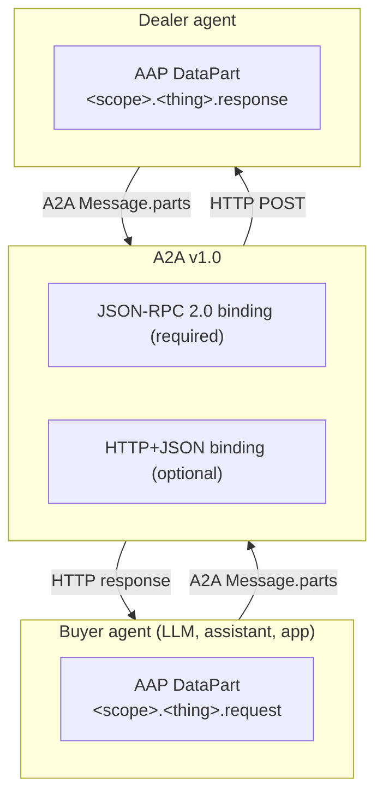

# Introduction


**Auto Agent Protocol (AAP) is a strict A2A v1.0 profile that defines the typed automotive data shapes AI agents and car dealerships exchange when they discover, browse, and submit leads.**

AAP does not invent a new wire protocol. It rides on top of the [A2A](https://a2a-protocol.org) (Agent2Agent) specification: every AAP message travels inside an A2A `Message.parts[].data` value as a typed `DataPart`. A JSON-RPC 2.0 interface is REQUIRED on every AAP agent card; an HTTP+JSON/REST interface MAY be added as an optional second binding. gRPC is out of scope for v1.0.

The extension is identified by a single URI:

```
https://autoagentprotocol.org/extensions/a2a-automotive-retail/v1.0
```

A dealer agent declares itself AAP-compliant by listing this URI in `capabilities.extensions[]` of its A2A agent card and by implementing **one or more** of the five standard AAP automotive skills. Agents pick the subset they support; AAP RECOMMENDS at least `inventory.search` + `lead.submit` for an end-to-end shopping flow, but neither is mandatory.

## What AAP standardizes


AAP v1.0 defines a **vocabulary** of five standard skill IDs that cover the read-and-lead lifecycle of automotive retail. A dealer agent picks whichever subset matches its capabilities — none of the five is individually mandatory.

| Skill | Purpose |
|---|---|
| `dealer.information` | Dealership profile, rooftops, hours, contact channels, capabilities |
| `inventory.facets` | Aggregated counts and ranges over the dealer's inventory |
| `inventory.search` | Filtered, paginated inventory queries |
| `inventory.vehicle` | Detail view of one specific vehicle (by VIN, stock, or vehicle_id) |
| `lead.submit` | Unified consented lead carrying customer info plus optional vehicle of interest, trade-in, and appointment |

It does NOT define authentication (v1.0 agents are public by default; auth is left to A2A), payments, financing approval, RFQ/quote workflows, trade-in valuations, or reservations. Future versions MAY extend this surface; v1.0 is intentionally minimal.

## Layered architecture


AAP sits as a profile on top of A2A, which itself sits on top of HTTP. AAP never touches the wire format directly — it defines the shape of typed `DataParts` that A2A bindings carry.



AAP uses exactly **one** A2A operation: `SendMessage` — a request `Message` goes in, a response `Message` comes out. The optional A2A surface (`SendStreamingMessage`, the `tasks` operations Get/List/Cancel/Subscribe, push notification configs, `GetExtendedAgentCard`) is out of scope for AAP v1.0: dealer agents do not need to implement it, and buyer agents MUST NOT require it. AAP only specifies the typed payloads inside `DataPart.data`.

## Quick start

A buyer agent talks to a compliant dealer agent in three steps.

### 1. Discover the agent

Fetch the A2A agent card at the dealer's well-known URL:

```bash
curl https://demo-toyota.example.com/.well-known/agent-card.json
```

Confirm the card lists the AAP extension URI under `capabilities.extensions[].uri` and includes a `supportedInterfaces[]` entry whose `protocolBinding` is `JSONRPC` (REQUIRED on every AAP agent card; an `HTTP+JSON` entry MAY also be present).

### 2. Pick a binding

Every AAP agent exposes the JSON-RPC 2.0 binding; a dealer MAY additionally offer HTTP+JSON. Both carry identical AAP payloads; gRPC is out of scope for AAP v1.0.

| Binding | Status | A2A spec | AAP page |
|---|---|---|---|
| JSON-RPC 2.0 | REQUIRED | A2A Section 9 | [JSON-RPC binding](./bindings/json-rpc.md) |
| HTTP+JSON | OPTIONAL | A2A Section 11 | [REST binding](./bindings/rest.md) |

### 3. Send a typed AAP message

Wrap an AAP request inside an A2A `Message` and send it with `SendMessage` — the single A2A operation AAP uses. Below is the simplest call — `dealer.information` over the REQUIRED JSON-RPC binding, using the A2A v1.0 ProtoJSON wire format (`ROLE_USER`/`ROLE_AGENT` enum names, no `kind` discriminators) that A2A v1.0 clients send and parse:

```bash
curl -X POST https://demo-toyota.example.com/a2a \
  -H "Content-Type: application/json" \
  -d '{
    "jsonrpc": "2.0",
    "id": 1,
    "method": "SendMessage",
    "params": {
      "message": {
        "messageId": "01HZ9G5N8D1Y4M6SP9C4XKVW3Q",
        "role": "ROLE_USER",
        "parts": [
          {
            "data": { "type": "dealer.information.request" },
            "mediaType": "application/vnd.autoagent.dealer-information-request+json"
          }
        ]
      },
      "configuration": {
        "acceptedOutputModes": ["application/vnd.autoagent.dealer-information-response+json"]
      }
    }
  }'
```

The dealer agent replies with a `SendMessageResponse` in the JSON-RPC `result` — `{ "message": <Message> }` — where the `message` is an A2A `Message` whose first `DataPart.data` is an AAP response:

```json
{
  "jsonrpc": "2.0",
  "id": 1,
  "result": {
    "message": {
      "messageId": "01HZ9G5P2KA8RT9WMS3B4C5D6E",
      "role": "ROLE_AGENT",
      "parts": [
        {
          "data": {
            "type": "dealer.information.response",
            "data": {
              "name": "Demo Auto Group",
              "welcome_message": "Welcome to Demo Auto Group.",
              "rooftops": [
                {
                  "name": "Demo Toyota San Francisco",
                  "legal_name": "Demo Toyota of San Francisco, LLC",
                  "website": "https://demo-toyota.example.com",
                  "phones": [
                    {
                      "name": "Sales",
                      "value": "+14155550100"
                    }
                  ],
                  "address": {
                    "country": "US",
                    "state": "CA",
                    "city": "San Francisco",
                    "address_line_1": "100 Market St",
                    "zip": "94105"
                  },
                  "timezone": "America/Los_Angeles",
                  "capabilities": [
                    "sales",
                    "service",
                    "financing"
                  ]
                }
              ]
            }
          },
          "mediaType": "application/vnd.autoagent.dealer-information-response+json"
        }
      ]
    }
  }
}
```

## Verified interoperability


All five skills have been exercised live through the official A2A v1.0 SDKs (`@a2a-js/sdk` and `a2a-sdk` for Python): inventory search, facets, vehicle detail, dealer information, and a consented `lead.submit` — with no AAP-specific client code.

## Where to read next

- [Why automotive needs AAP](./why.md) — the gap AAP fills against A2A, ACP, MCP, and ADF.
- [A2A profile](./a2a-profile.md) — how AAP slots into A2A's three-layer architecture.
- [Discovery](./discovery.md) — full agent card example.
- [Pricing and FTC compliance](./pricing-and-ftc.md) — the four pricing fields and why `price` is the FTC-final out-the-door amount.
- [Skills reference](./skills/dealer-information.md) — one page per skill with full request/response examples.
