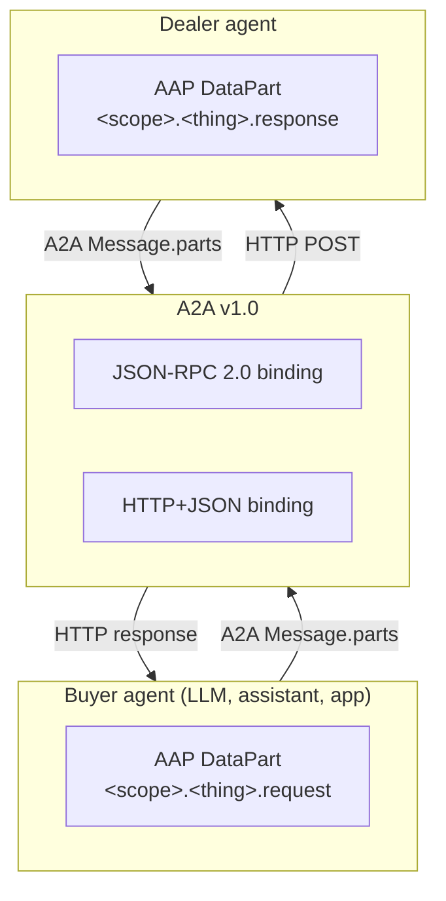

# Introduction


**Auto Agent Protocol (AAP) is a strict A2A v1.0 profile that defines the typed automotive data shapes AI agents and car dealerships exchange when they discover, browse, and submit leads.**

AAP does not invent a new wire protocol. It rides on top of the [A2A](https://a2a-protocol.org) (Agent2Agent) specification: every AAP message travels inside an A2A `Message.parts[].data` value as a typed `DataPart`. Dealers MAY expose their AAP skills via either A2A binding — JSON-RPC 2.0 or HTTP+JSON/REST. gRPC is out of scope for v0.1.

The extension is identified by a single URI:

```
https://autoagentprotocol.org/extensions/a2a-automotive-retail/v0.1
```

A dealer agent declares itself AAP-compliant by listing this URI in `capabilities.extensions[]` of its A2A agent card and by implementing **one or more** of the five standard AAP automotive skills. Agents pick the subset they support; AAP RECOMMENDS at least `inventory.search` + `lead.submit` for an end-to-end shopping flow, but neither is mandatory.

## What AAP standardizes


AAP v0.1 defines a **vocabulary** of five standard skill IDs that cover the read-and-lead lifecycle of automotive retail. A dealer agent picks whichever subset matches its capabilities — none of the five is individually mandatory.

| Skill | Purpose |
|---|---|
| `dealer.information` | Dealership profile, locations, brands, hours, contact channels, capabilities |
| `inventory.facets` | Aggregated counts and ranges over the dealer's inventory |
| `inventory.search` | Filtered, paginated inventory queries |
| `inventory.vehicle` | Detail view of one specific vehicle (by VIN, stock, or vehicle_id) |
| `lead.submit` | Unified consented lead carrying customer info plus optional vehicle of interest, trade-in, and appointment |

It does NOT cover authentication beyond `bearer`, payments, financing approval, RFQ/quote workflows, trade-in valuations, or reservations. Future versions MAY extend this surface; v0.1 is intentionally minimal.

## Layered architecture


AAP sits as a profile on top of A2A, which itself sits on top of HTTP. AAP never touches the wire format directly — it defines the shape of typed `DataParts` that A2A bindings carry.



Anything an A2A client already does — message envelopes, task model, error mapping, server-sent events — works unchanged. AAP only specifies the typed payloads inside `DataPart.data`.

## Quick start

A buyer agent talks to a compliant dealer agent in three steps.

### 1. Discover the agent

Fetch the A2A agent card at the dealer's well-known URL:

```bash
curl https://demo-toyota.example.com/.well-known/agent-card.json
```

Confirm the card lists the AAP extension URI under `capabilities.extensions[].uri` and exposes at least one `supported_interfaces[]` entry whose `protocol_binding` is `JSONRPC` or `HTTP+JSON`.

### 2. Pick a binding

A2A defines two protocol bindings AAP supports. Both carry identical AAP payloads.

| Binding | A2A spec | AAP page |
|---|---|---|
| JSON-RPC 2.0 | A2A Section 9 | [JSON-RPC binding](./bindings/json-rpc.md) |
| HTTP+JSON | A2A Section 11 | [REST binding](./bindings/rest.md) |

### 3. Send a typed AAP message

Wrap an AAP request inside an A2A `Message` and POST it to the agent endpoint. Below is the simplest call — `dealer.information` over the HTTP+JSON binding (using the [A2A v1.0](https://a2a-protocol.org/latest/specification/#a21-breaking-change-kind-discriminator-removed) wire format):

```bash
curl -X POST https://demo-toyota.example.com/a2a/message:send \
  -H "Content-Type: application/json" \
  -d '{
    "message": {
      "messageId": "01HZ9G5N8D1Y4M6SP9C4XKVW3Q",
      "role": "ROLE_USER",
      "parts": [
        {
          "data": { "type": "dealer.information.request" },
          "mediaType": "application/vnd.autoagent.dealer-information-request+json"
        }
      ]
    },
    "configuration": {
      "acceptedOutputModes": ["application/vnd.autoagent.dealer-information-response+json"]
    }
  }'
```

The dealer agent replies with an A2A `Message` whose first `DataPart.data` is an AAP response:

```json
{
  "message": {
    "messageId": "01HZ9G5P2KA8RT9WMS3B4C5D6E",
    "role": "ROLE_AGENT",
    "parts": [
      {
        "data": {
          "type": "dealer.information.response",
          "data": {
            "dealer_id": "dealer_demo_toyota",
            "legal_name": "Demo Toyota of San Francisco, LLC",
            "trade_name": "Demo Toyota",
            "brands": ["Toyota"],
            "address": {
              "address_line_1": "100 Market St",
              "city": "San Francisco",
              "state": "CA",
              "zip": "94105"
            }
          }
        },
        "mediaType": "application/vnd.autoagent.dealer-information-response+json"
      }
    ]
  }
}
```

## Where to read next

- [Why automotive needs AAP](./why.md) — the gap AAP fills against A2A, ACP, MCP, and ADF.
- [A2A profile](./a2a-profile.md) — how AAP slots into A2A's three-layer architecture.
- [Discovery](./discovery.md) — full agent card example.
- [Contract manifest](./contract-manifest.md) — machine-readable skill mapping for planning agents.
- [Pricing and FTC compliance](./pricing-and-ftc.md) — the four pricing fields and why `price` is the FTC-final out-the-door amount.
- [Skills reference](./skills/dealer-information.md) — one page per skill with full request/response examples.
