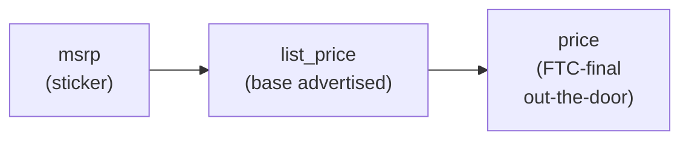

# Pricing and FTC compliance


AAP standardizes three explicit pricing fields on every vehicle. The single most important rule:

> **`price` is the FTC-final out-the-door amount.** It is the total amount the buyer would pay for this specific vehicle, including all required fees, mandatory add-ons, and any conditions on dealer financing. Anything less is a violation of FTC enforcement policy.

This rule is non-negotiable. Dealers MUST keep `price` accurate; buyer agents and aggregators rely on it to compare offers honestly across dealers.

## Why the FTC rule exists

In March 2026 the FTC sent warning letters to 97 auto dealership groups about deceptive pricing practices. The letters specifically called out the practice of advertising a price that excludes mandatory fees, conditions on dealer-arranged financing, or required dealer add-ons.

- **FTC press release (March 2026):** [FTC warns 97 auto dealership groups about deceptive pricing](https://www.ftc.gov/news-events/news/press-releases/2026/03/ftc-warns-97-auto-dealership-groups-about-deceptive-pricing)
- **FTC CARS Rule:** the underlying federal rule that requires "offering price" to reflect the full price minus only required government charges and optional add-ons.

AAP's `price` field is the protocol-level expression of that rule. Buyer agents — including LLM-driven shopping assistants — sort, filter, and compare dealers on `price`. If a dealer publishes a `price` that is not the final amount, the buyer agent will surface that vehicle as artificially cheap and the dealer will be advertising a deceptive price across every agent that touches the API.

## The three pricing fields

Every `Vehicle` object in AAP MAY carry three integer price fields (whole US dollars). Each has a precise meaning.

| Field | Required? | Meaning | Includes mandatory fees / add-ons? | Notes |
|---|---|---|---|---|
| `msrp` | optional | Manufacturer's Suggested Retail Price (sticker price). | no | Set by the OEM, not the dealer. |
| `list_price` | optional | Dealer's advertised base list price BEFORE incentives and fees. | no | The number the dealer would put on a window sticker as their asking price, separate from required fees. |
| `price` | RECOMMENDED | **FTC-final out-the-door price** after all incentives, mandatory fees, and required add-ons. | yes | The single number a buyer agent uses for comparison and the only one used by `inventory.search` `price_min` / `price_max` filters and `sort.field: "price"`. |

Each is a plain integer in whole US dollars:

```json
26780
```

### How the fields relate



`msrp` is informational only. `list_price` is the base advertised number BEFORE incentives and fees. `price` is the final number — the FTC-final out-the-door amount, and the only one a buyer agent should use to make comparisons or run `price_min` / `price_max` filters.

## Concrete worked example

A 2022 Honda Civic listed by a California dealer:

```json
{
  "vehicle_id": "vehicle_demo_civic",
  "vin": "1HGCV1F30KA000001",
  "year": 2022,
  "make": "Honda",
  "model": "Civic",
  "condition": "cpo",
  "msrp": 26500,
  "list_price": 24990,
  "price": 26780,
  "status": "available",
  "inventory_date": "2026-04-12",
  "updated_at": "2026-04-30T10:15:00Z"
}
```

What the buyer is actually being asked to pay: **$26,780**. That is the FTC-final out-the-door figure. The other two fields are descriptive context. A buyer agent shopping for a Civic at "under $27,000" should match this listing on `price`, not `list_price`.

If the same dealer lists the same VIN with `price: 24990` while charging the customer $26,780 at the dealership, that is the exact pattern the FTC's 2026 warnings target.

## What dealers MUST and MUST NOT do

These are normative; they are also restated in the [Behavior rules](./behavior-rules.md) page.

- Dealers MUST publish `price` as the final out-the-door amount including all mandatory fees, conditions on financing, and required add-ons.
- Dealers MUST NOT advertise a `price` that omits required fees, conditions on dealer financing, or required add-ons.
- Dealers SHOULD publish `list_price` and `msrp` for transparency, but the buyer agent will compare on `price`.
- Buyer agents MUST use `price` (not `list_price`) for filters and sort by default. AAP defines `inventory.search`'s `price_min` / `price_max` filters and `sort.field: "price"` against the `price` field for exactly this reason.

## How `price` is used elsewhere in AAP

- `inventory.search` — `filters.price_min` and `filters.price_max` apply to `price`. `sort.field` accepts `"price"` (default sort comparator) and also `"list_price"`, `"msrp"` for those who want to sort on a specific field.
- `inventory.vehicle` — the response SHOULD carry `price` (RECOMMENDED); when present, it follows the FTC all-in rules above.
- `inventory.facets` — `price_range` aggregates min/max `price` values across the matching set.

For full request/response shapes see the [skills reference](./skills/inventory-search.md).
