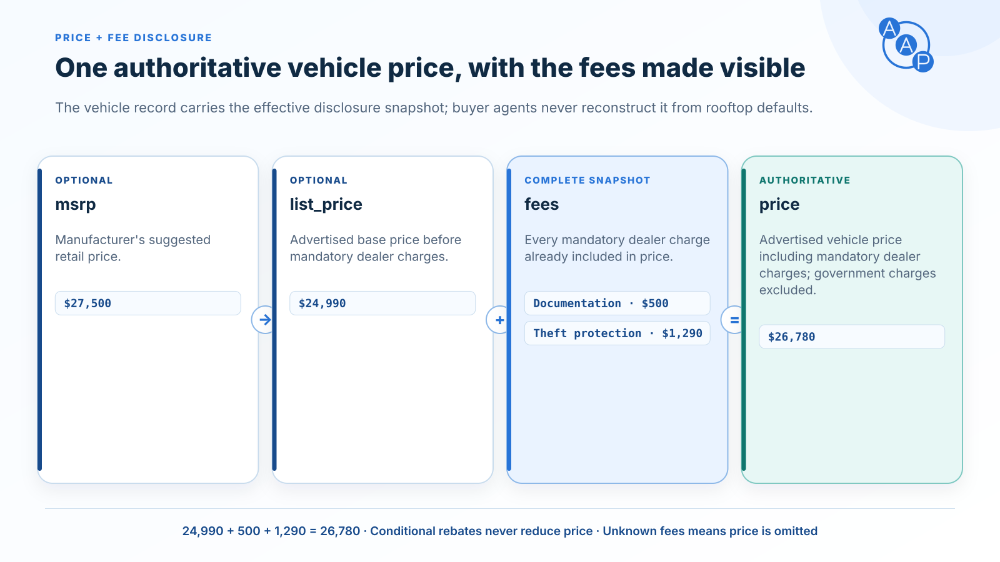

# Pricing and fee disclosure



AAP separates a vehicle's base pricing context from the price a dealer actually advertises, and makes mandatory dealer charges explicit.

> **`price` is the authoritative advertised vehicle price.** It includes every mandatory, non-government dealer charge and dealer-required add-on. The accompanying `fees` array itemizes charges already included in `price`; never add them to `price` again.

`price` is deliberately **not** called an out-the-door price. Sales tax, title, registration, and other required government charges vary by buyer and jurisdiction and are excluded. A true out-the-door quote requires buyer-specific context.

This page defines protocol behavior, not legal advice. Dealers remain responsible for federal, state, and local requirements.

## Current FTC context

In March 2026, the FTC warned 97 auto dealership groups that advertised prices must include all mandatory fees. The agency also identified advertisements that use rebates unavailable to all consumers, require an extra down payment, condition price on dealer financing, or omit required add-ons as potentially illegal pricing practices under Section 5 of the FTC Act.

- [FTC announcement about deceptive auto pricing (March 2026)](https://www.ftc.gov/news-events/news/press-releases/2026/03/ftc-warns-97-auto-dealership-groups-about-deceptive-pricing)
- [FTC sample warning letter](https://www.ftc.gov/system/files/ftc_gov/pdf/warning-letter-to-best-price-dealer.pdf)

The FTC's separate CARS Rule is **not in force**. The Fifth Circuit [vacated it on January 27, 2025](https://www.ca5.uscourts.gov/opinions/pub/24/24-60013-CV0.pdf), and the FTC later [withdrew the vacated rule](https://public-inspection.federalregister.gov/2026-02866.pdf). AAP therefore does not claim that the CARS Rule is the source of these contract requirements. The contract instead adopts a transparent pricing model that aligns with the FTC's current enforcement statements and makes safer comparison possible.

## Pricing fields

Every amount is an integer in whole US dollars.

| Field | Required? | Meaning | Buyer-agent treatment |
|---|---|---|---|
| `msrp` | optional | Manufacturer's Suggested Retail Price. | Context only. |
| `list_price` | optional | Dealer's base list price before discounts, rebates, mandatory dealer charges, and required add-ons. | Context only; never present it as the payable price. |
| `price` | optional | Authoritative advertised vehicle price after universally available discounts and including all mandatory dealer charges and required add-ons. Excludes government charges. | Use for price filters, sorting, and comparisons. When present, `fees` is required. |
| `fees` | required with `price` | Complete effective list of mandatory, non-government dealer charges and required add-ons already included in `price`. | Display alongside `price`; do not add the amounts again. |

`price` may reflect only discounts or rebates available to every consumer. A discount that depends on military service, recent graduation, loyalty, conquest, financing choice, trade-in, or another eligibility condition must not reduce `price`.

AAP does not add a second `final_price` field. `price` is the one authoritative advertised total; two competing totals would invite ambiguity and stale data. A buyer-specific out-the-door quote is a later calculation outside this inventory contract.

## Fee states

`fees` has three intentionally different states:

| Representation | Meaning |
|---|---|
| field omitted | Fee status is unknown or undisclosed. `price` must also be omitted. |
| `"fees": []` | The publisher affirmatively reports no mandatory dealer charges or required add-ons for this vehicle. |
| non-empty `fees` | The array is the complete effective fee snapshot for this vehicle. |

Each fee is `{ "name": string, "amount": integer }`. It covers mandatory, non-government dealer charges and dealer-required add-ons. It excludes optional products and government charges such as tax, title, and registration.

```json
{
  "name": "Documentation fee",
  "amount": 500
}
```

## Rooftop defaults versus vehicle snapshots

A rooftop MAY publish `fees` in `dealer.information` as its complete default schedule. This avoids repeating configuration inside a dealer's own source system, but it does not create a consumer-side join.

The resolution rule is simple:

1. The inventory publisher MAY start with the rooftop defaults.
2. It resolves any vehicle-specific differences before returning inventory.
3. Every vehicle with `price` carries its complete effective `fees` snapshot.
4. Buyer agents use only `Vehicle.fees`. They MUST NOT fetch `dealer.information` to complete a price, join by the mutable rooftop name, or merge rooftop and vehicle fee arrays.

When vehicle fees differ from rooftop defaults, `Vehicle.fees` replaces the rooftop array in full. It is never a delta. This keeps inventory responses self-contained, deterministic, and safe when dealer information is missing or cached at a different time.

## Arithmetic and discounts

The protocol does not require `list_price + sum(fees) == price`. For example, a universally available discount can make the values differ:

```json
{
  "vehicle_id": "vehicle_demo_civic",
  "year": 2022,
  "make": "Honda",
  "model": "Civic",
  "condition": "cpo",
  "msrp": 26500,
  "list_price": 24990,
  "price": 26280,
  "fees": [
    { "name": "Documentation fee", "amount": 500 },
    { "name": "Pre-installed theft protection", "amount": 1000 }
  ],
  "status": "available",
  "updated_at": "2026-04-30T10:15:00Z"
}
```

Here, the dealer applied a $210 discount available to every buyer: `$24,990 - $210 + $1,500 = $26,280`. `price` remains authoritative. Buyer agents display `$26,280` and the two included fees; they do not derive a replacement price from `list_price`.

If the relationship is not explained or cannot be reconstructed, consumers still use `price` and `fees` and SHOULD suppress or de-emphasize `list_price` rather than inventing a discount. Future protocol work may add a structured incentives model; `fees` must not be overloaded for discounts.

## Provider mapping

| Provider data | AAP mapping |
|---|---|
| Complete advertised price plus complete fee status | Publish `price` and `fees` (`[]` when there are affirmatively no mandatory dealer charges). |
| Base or list amount only | Publish `list_price`; omit `price`. |
| Advertised amount but mandatory fee status is unknown | Do not publish that amount as `price`. Publish it as `list_price` only if it truly has list-price semantics. |
| Amount reduced by a conditional rebate | Do not publish it as `price`. Publish the non-conditional advertised amount, or omit `price` if that amount is unavailable. |
| Rooftop defaults plus vehicle exceptions | Resolve the defaults inside the publisher, then emit one complete `Vehicle.fees` array. |

## Normative behavior

- Publishers MUST include `fees` whenever they include `price`.
- Publishers MUST include all mandatory, non-government dealer charges and required add-ons in `price` and itemize them in `fees`.
- Publishers MUST NOT reduce `price` with a rebate or discount unavailable to every consumer.
- Publishers MUST NOT reduce `price` by an additional required down payment or condition it on dealer financing.
- Publishers MUST NOT include optional products or government charges in `fees`.
- Buyer agents MUST NOT add `fees[].amount` to `price`.
- Buyer agents MUST use `price`, not `list_price`, for `price_min`, `price_max`, `sort.field: "price"`, and cross-dealer comparisons.
- Buyer agents MUST NOT infer missing fees from a rooftop or another vehicle.

`inventory.facets.price_range` likewise aggregates available `price` values. Vehicles without `price` remain valid inventory results, but they cannot safely participate in price-based comparisons without provider-specific behavior that the protocol does not standardize.
