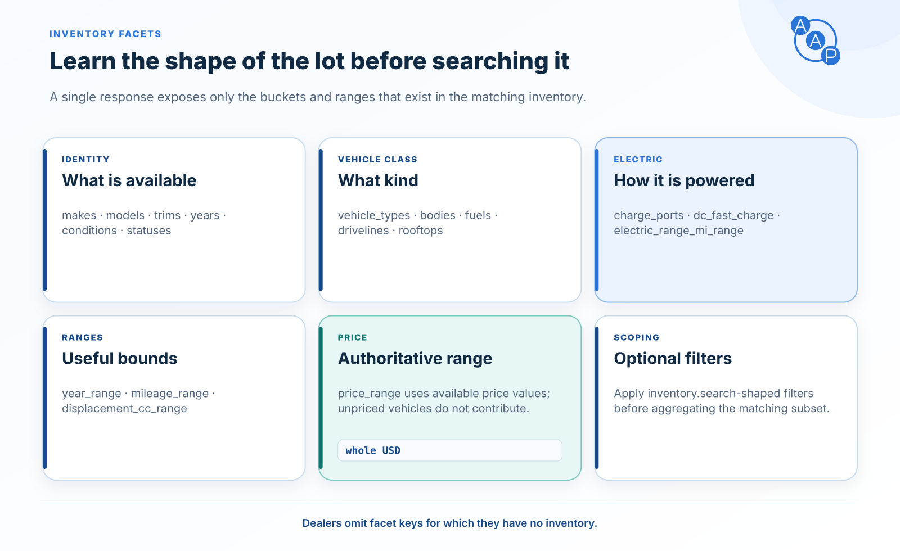

# `inventory.facets`



:::info A2A invocation
This skill is invoked through A2A's `SendMessage` operation — the single A2A operation AAP v1.3.0 uses — not a dedicated REST URL. It travels as the `SendMessage` JSON-RPC method on AAP's sole transport, the [JSON-RPC binding](../bindings/json-rpc.md). (The HTTP+JSON binding was [removed in v1.1.0](../bindings/rest.md).) AAP only defines what goes inside `Message.parts[].data`.
:::

The `inventory.facets` skill returns aggregated facet counts and ranges over a dealer's inventory. A buyer agent uses it to discover what a dealer actually carries before composing a search — for example, to learn the set of available makes and models, the year range, or the price ceiling.

| Property | Value |
|---|---|
| Skill id | `inventory.facets` |
| Request type | `inventory.facets.request` |
| Response type | `inventory.facets.response` |
| Anonymous allowed | yes |
| Consent required | no |
| ADF compatible | no |

## Request shape

```json
{
  "type": "inventory.facets.request",
  "filters": {
    "...": "(same shape as inventory.search filters; all optional)"
  }
}
```

| Field | Type | Required | Description |
|---|---|---|---|
| `type` | const | yes | `inventory.facets.request`. |
| `filters` | object | no | Optional scoping filters. Same shape as the [`inventory.search`](./inventory-search.md) filter block; all fields are optional. |

When `filters` is absent, facets are aggregated over the dealer's entire inventory. When it is present, facets are aggregated over only the matching subset (e.g. all `condition: ["used"]` listings).

## Response shape

```json
{
  "type": "inventory.facets.response",
  "data": {
    "makes":                 [{ "value": "string", "count": 0 }],
    "models":                [{ "value": "string", "count": 0 }],
    "trims":                 [{ "value": "string", "count": 0 }],
    "years":                 [{ "value": 0,        "count": 0 }],
    "conditions":            [{ "value": "string", "count": 0 }],
    "transmissions":         [{ "value": "string", "count": 0 }],
    "fuels":                 [{ "value": "string", "count": 0 }],
    "dc_fast_charge":        [{ "value": "true | false", "count": 0 }],
    "charge_ports":          [{ "value": "string", "count": 0 }],
    "drivelines":            [{ "value": "string", "count": 0 }],
    "bodies":                [{ "value": "string", "count": 0 }],
    "vehicle_types":         [{ "value": "car | motorcycle | trailer | rv | other", "count": 0 }],
    "exterior_colors":       [{ "value": "string", "count": 0 }],
    "interior_colors":       [{ "value": "string", "count": 0 }],
    "rooftops":              [{ "value": "string", "count": 0 }],
    "statuses":              [{ "value": "available | intransit | pending", "count": 0 }],
    "price_range":            { "min": 0, "max": 0 },
    "mileage_range":          { "min": 0, "max": 0 },
    "year_range":             { "min": 0, "max": 0 },
    "displacement_cc_range":  { "min": 0, "max": 0 },
    "electric_range_mi_range":{ "min": 0, "max": 0 }
  }
}
```

Each facet array entry is `{ value, count }` where `value` is the facet term (string or integer) and `count` is the number of matching listings. The `statuses` facet's `value` is drawn from the controlled vehicle status enum — `available`, `intransit`, or `pending` — since those are the only statuses that appear in inventory feeds. The `*_range` fields are `{ min, max }` numeric ranges (`price_range` in whole US dollars, `displacement_cc_range` in cc, `electric_range_mi_range` in miles).

Powersports dealers additionally return `vehicle_types` (`car` | `motorcycle` | `trailer` | `rv` | `other`), `bodies` (which for motorcycles carry segments like `cruiser`/`touring`), and `displacement_cc_range`, matching the filters on [`inventory.search`](./inventory-search.md). Electric inventory adds `electric_range_mi_range`, `dc_fast_charge`, and `charge_ports`. A dealer omits any facet key for which it has no inventory.

`price_range` aggregates available authoritative `price` values, which include mandatory dealer charges and exclude government charges (see [Pricing and fee disclosure](../pricing-and-ftc.md)). Vehicles without `price` do not contribute; omit `price_range` when no matching vehicle has `price`.

## Scoped facets example

Used-only facets:

### Request

```json
{
  "type": "inventory.facets.request",
  "filters": { "condition": ["used"] }
}
```

### Response

```json
{
  "type": "inventory.facets.response",
  "data": {
    "makes": [
      { "value": "Honda",  "count": 12 },
      { "value": "Toyota", "count": 27 }
    ],
    "models": [
      { "value": "Civic",   "count": 5 },
      { "value": "Accord",  "count": 4 },
      { "value": "Camry",   "count": 9 },
      { "value": "Corolla", "count": 8 }
    ],
    "conditions": [
      { "value": "used", "count": 39 }
    ],
    "statuses": [
      { "value": "available", "count": 34 },
      { "value": "intransit", "count": 3 },
      { "value": "pending",   "count": 2 }
    ],
    "year_range":    { "min": 2015, "max": 2024 },
    "price_range":   { "min": 9990, "max": 38990 },
    "mileage_range": { "min": 8400, "max": 142000 }
  }
}
```

## When to use it

- The buyer agent wants to enumerate the dealer's makes/models before constructing a search.
- The buyer agent needs to surface a price slider or year filter to the user.
- The buyer agent wants a count of the dealer's used inventory before recommending a deeper conversation.

`inventory.facets` is anonymous and consent-free. The dealer agent SHOULD return the same set of facet keys regardless of filter, omitting only those for which it has no inventory.
