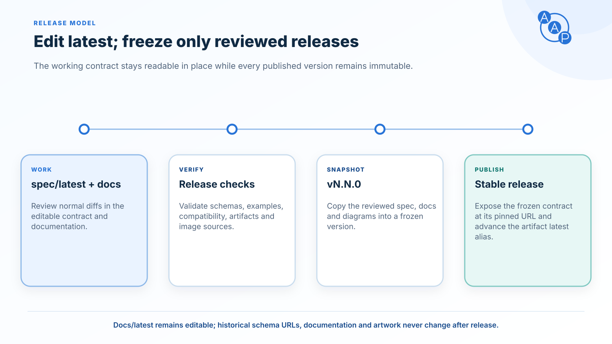

# Versioning



Auto Agent Protocol uses [Semantic Versioning](https://semver.org/) for approved releases. The repository deliberately separates editable work from public releases:

- `spec/latest/` is the only editable specification source.
- `spec/v{major}.{minor}/` is an immutable release snapshot.
- `https://autoagentprotocol.org/latest/` aliases the latest **approved contract release**, not `spec/latest/`.
- `https://autoagentprotocol.org/docs/latest/` serves the editable documentation and links to the newest frozen documentation release.
- There is no `next` directory, URL, or package channel.

The word “latest” therefore has scoped meanings: `spec/latest/` and `/docs/latest/` expose current work, while the public contract-artifact `/latest/` URL means the latest stable release. Draft schema identifiers use the non-routable `https://draft.autoagentprotocol.invalid` namespace so they cannot be mistaken for a public contract.

## SemVer policy

Every release is represented by a full SemVer such as `1.3.0` and a public major/minor contract path such as `v1.3`. Human-facing release labels always use all three SemVer components (`1.2.0`); wire identifiers, folders, and URLs use the corresponding major/minor contract label (`v1.2`). Because the URL cannot distinguish patch snapshots, the release tool only creates `MAJOR.MINOR.0` contracts. Editorial corrections can be made in the editable docs and included in a later release; published snapshots are not rewritten.

| Change | Required release |
|---|---|
| New optional field, schema, skill, or behavior | Minor |
| Removed or renamed field; tighter type or enum | Major |
| Changed required-field meaning | Major |
| Documentation or example changes included in a snapshot | Next minor or major snapshot |

The automated compatibility report is conservative and structural. A minor candidate is refused when it detects a validation-affecting change. Passing that check does not replace maintainer review of semantics, security, legal text, or interoperability.

## Stable identifiers

Released schemas and extensions are version-pinned:

```text
https://autoagentprotocol.org/v1.3/schemas/vehicle.schema.json
https://autoagentprotocol.org/extensions/aap/v1.3
```

The schema `$id` matches its public URL. Relative `$ref` values stay within the same release. A dealer advertises the supported AAP version through the A2A extension URI; buyer agents should use the exact version the dealer advertises.

## Immutability

A release freezes all material needed to reproduce and review it:

- schemas, examples, and `skills.yaml`;
- documentation and sidebar snapshots;
- generated TypeScript, JSON-RPC OpenAPI, and MCP artifacts;
- release provenance, compatibility report, and SHA-256 integrity manifest;
- version-specific documentation images referenced by the snapshot.

CI compares the entire pull request with its base commit and rejects additions, edits, deletions, copies, or renames within an already released path. Integrity manifests also detect local or post-merge drift. Release artifacts are copied from their reviewed snapshots; old releases are never regenerated with newer tooling.

## Public latest and released versions

`releases.json` is the explicit registry of approved releases and names exactly one stable release. The production build copies that frozen contract to both its pinned artifact URL and `/latest/`. Documentation keeps the editable latest pages and every frozen version separately visible.

| URL | Meaning |
|---|---|
| `/v1.3/...` | Immutable production contract |
| `/latest/...` | Alias of the registry's stable release |
| `/docs/latest/...` | Editable latest documentation, with an unreleased banner |
| `/docs/v1.3/...` | Immutable documentation for release 1.3.0 |

Production agents should pin `/v1.3/` (or another advertised contract), because `/latest/` advances when maintainers approve a new release.

## Release process

All normal changes edit `spec/latest/` and `docs/`. A maintainer then rehearses a release:

```bash
pnpm release:prepare 2.0.0 --dry-run
```

After reviewing the compatibility report and committing the approved draft, the maintainer runs the command without `--dry-run`. It copies the working source into new pinned directories, transforms draft identifiers, validates schemas and examples, generates artifacts, records provenance and hashes, updates the stable registry, and leaves `spec/latest/` unchanged.

The command refuses an existing destination, a dirty working tree, a skipped version, a patch contract, or a breaking minor candidate. It does not commit, tag, push, publish packages, or deploy the site. Those remain explicit review steps. See [RELEASING.md](https://github.com/auto-agent-protocol/auto-agent-protocol/blob/main/RELEASING.md) for the maintainer checklist.

## A2A protocol version

AAP's own SemVer above governs the AAP contract. The A2A protocol version is separate and is negotiated per request. A dealer agent's obligations under A2A §3.6.2:

- It MUST process a request using the semantics of the `A2A-Version` the client sent, matching on `Major.Minor`.
- It MUST interpret an empty value as `0.3` — not as the newest version it serves.
- It MUST return `VersionNotSupportedError` (-32009) when the interface does not serve the requested version.
- It MAY expose several interfaces for the same transport at different A2A versions, under the same or different URLs.

## For implementers

- These changes require the next major release. The existing v1.3 contract and packages remain unchanged until a separate release is approved. New wire behavior MUST NOT be deployed behind the existing v1.3 extension URI.
- `error.data` becomes an array of `@type`-tagged objects, per A2A §9.5. Earlier AAP contracts put a bare `aap.error` object there. Buyers supporting both versions preserve the raw error envelope and accept the shape for the dealer's advertised contract. For the array form, locate the detail by `@type`; for the old object form, verify `type === "aap.error"`. Handle A2A protocol errors separately, since they need not contain an AAP detail.
- `RATE_LIMITED` changes from -32002 to -32000 and `UNSUPPORTED_SKILL` from -32601 to -32004. Dispatch AAP behavior from the typed payload's `code` and `retryable`, rather than assuming the numeric transport code identifies one AAP condition. Some SDKs discard unknown-code details; see [SDK error handling](./errors.md).
- The AAP extension is newly required. Update buyers to send `A2A-Version` and activate the exact AAP extension URI before enabling the new contract. Keep support for the old contract for as long as deployed clients need it; this specification does not impose a one-release transition window.
- Pin the version advertised by the dealer; do not infer compatibility.
- Validate against version-pinned schema URLs.
- A dealer migrating between AAP versions serves each version from its own agent card and interface URL. AAP requires exactly one AAP extension URI per card to select an unambiguous contract. Multiple required extension entries mean all must be activated; they do not negotiate alternative versions. A2A §4.6.3 separately forbids automatic fallback to an earlier extension version.
- Do not use repository draft identifiers on the wire.
- Do not depend on `/latest/` remaining on the same release.
